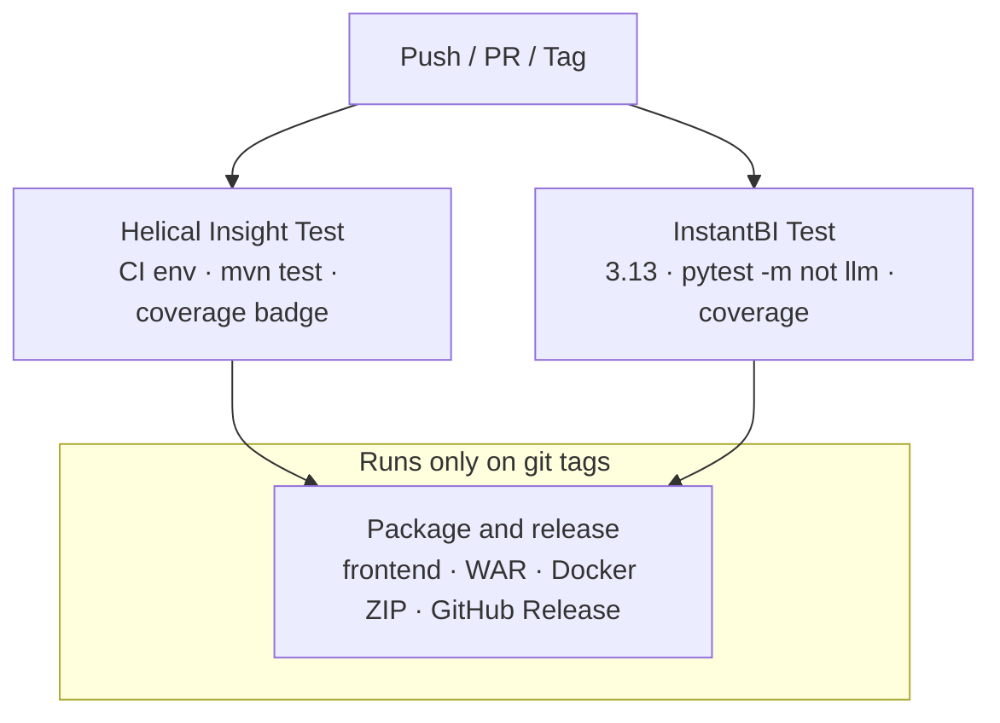

# GitHub Actions workflow

Workflow file: [`maven.yml`](maven.yml) — **Build HelicalInsight**

## When it runs

| Event | What runs |
|-------|-----------|
| Push (any branch) | `Helical Insight Test` and `InstantBI Test` in parallel |
| Pull request → `master` | `Helical Insight Test` and `InstantBI Test` in parallel |
| Git tag (`v*` or `*.*.*`) | Above, plus **Package and release (WAR + Docker ZIP)** |

## Diagram



## Job details

1. **Helical Insight Test** — Sets up CI test env, runs `mvn test`, writes JaCoCo badge
2. **InstantBI Test** — Instant BI (`instantbi/src/com/helicalinsight/instantbi`). Python 3.13, pip install, `pytest -m "not llm"` with line + branch coverage (stub LLM mode; DeepEval tests skipped). Writes a job summary (Coverage / Branches) and uploads HTML + XML coverage artifacts
3. **Package and release** *(tags only)* — Needs `Helical Insight Test` and `InstantBI Test`:
   - Build React frontend → copy into webapp
   - `mvn package -DskipTests` → WAR
   - [`scripts/package-docker.sh`](../../scripts/package-docker.sh) → runnable Docker ZIP
   - Upload Actions artifacts + create **GitHub Release** with Docker ZIP assets
    (release notes body is left for manual edit after the run)

## Release assets

| File | Purpose |
|------|---------|
| `helicalinsight-docker.zip` | **Stable latest download**

Docker ZIP contents:

- `docker-compose.yml`, `.env` / `.env.example`, `config/`, `readme/`
- `hi/hi-ee.war`, `hi/hi-repository/`, `hi/db/` (sample data), `hi/tomcat/logs/`
- `instantbi/com/helicalinsight/instantbi/` (Instant BI app; bind-mounted to `/app`)
- Instant BI YAML copied at package time into `hi/hi-repository/System/InstantBI/` (bind-mounted to `/app/helicalbi/config`)

Local package (after building the WAR):

```bash
./scripts/package-docker.sh 7.0.0
# → dist/helicalinsight-7.0.0-docker.zip
```

## Efficiency notes

- **Concurrency** — cancels superseded runs on the same non-protected ref
- **Caches** — Maven (`server/pom.xml`), npm (`client/package-lock.json`), pip (Instant BI `requirements*.txt`)
- **Release skips re-test** — packaging runs only after green `Helical Insight Test` and `InstantBI Test`
- **Single package script** — same ZIP locally or in CI

## Related product docs

- Docker start guide: [`docker/readme/readme.md`](../../docker/readme/readme.md)
- Root README: [`../../README.md`](../../README.md)
