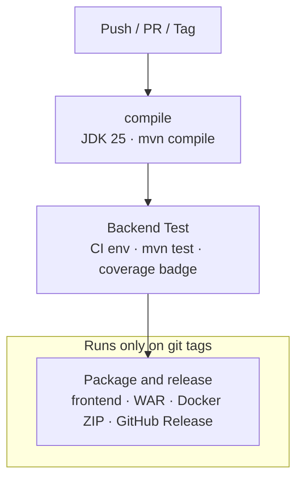

# GitHub Actions workflow

Workflow file: [`maven.yml`](maven.yml) — **Build HelicalInsight**

## When it runs

| Event | What runs |
|-------|-----------|
| Push (any branch) | `compile` → `Backend Test` |
| Pull request → `master` | `compile` → `Backend Test` |
| Git tag (`v*` or `*.*.*`) | Above, plus **Package and release (WAR + Docker ZIP)** |

## Diagram



## Job details

1. **compile** — Checkout, Temurin JDK 25, `mvn clean compile` (`-Dedition=hice`)
2. **Backend Test** — Needs `compile`. Sets up CI test env, runs `mvn test`, writes JaCoCo badge
3. **Package and release** *(tags only)* — Needs `Backend Test`:
   - Build React frontend → copy into webapp
   - `mvn package -DskipTests` → WAR
   - [`scripts/package-docker.sh`](../../scripts/package-docker.sh) → runnable Docker ZIP
   - Upload Actions artifacts + create **GitHub Release** with both assets

## Release assets

| File | Purpose |
|------|---------|
| `helicalinsight-<version>-docker.zip` | **Recommended for end users** — unzip and `docker compose up -d` |
| `hi-ee-<version>.war` | Deploy to an existing Tomcat 11 |

Docker ZIP contents (aligned with Jenkins packaging + git `docker/` layout):

- `docker-compose.yml`, `.env` / `.env.example`, `config/`, `readme/`
- `hi/hi-ee.war`, `hi/hi-repository/`, `hi/db/` (sample data), `hi/tomcat/logs/`
- `instantbi/helicalbi/` (Instant BI app)

Local package (after building the WAR):

```bash
./scripts/package-docker.sh 7.0.0
# → dist/helicalinsight-7.0.0-docker.zip
```

## Efficiency notes

- **Concurrency** — cancels superseded runs on the same non-protected ref
- **Caches** — Maven (`server/pom.xml`) and npm (`client/package-lock.json`)
- **Release skips re-test** — packaging runs only after green `Backend Test`
- **Single package script** — same ZIP locally or in CI

## Related product docs

- Docker start guide: [`docker/readme/readme.md`](../../docker/readme/readme.md)
- Root README: [`../../README.md`](../../README.md)
