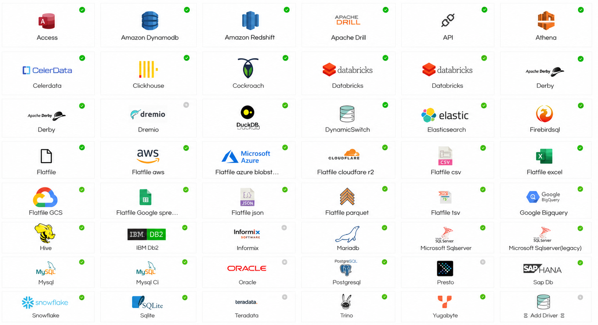

# Helical Insight

A Unified Open Source Enterprise Ready Embedded BI with AI Capabilities ~ providing all enterprise features in the open source free version.  

[](https://github.com/helicalinsight/helicalinsight/releases)
[](https://github.com/helicalinsight/helicalinsight/releases/latest)
[](https://github.com/helicalinsight/helicalinsight/stargazers)

[](https://hub.docker.com/)

[Helical Insight](https://www.helicalinsight.com/) is an open source embeddable BI product providing a unified BI experience which includes.
 - AI assisted chat driven analytics with option of bring your own LLM
 - Paginated pixel perfect printer friendly reports (similar to crystal reports, SSRS etc)
 - Interactive dashboards with drill down drill through and interactivity 

**Resources**

- 🌐 Website: https://www.helicalinsight.com/
- 📦 Installation: https://www.helicalinsight.com/helical-insight-docker-installation/
- 🚀 Getting Started: https://www.helicalinsight.com/getting-started-with-helical-insight/
- 💬 Forum: https://forum.helicalinsight.com/
- 🎥 Usage Videos: https://www.helicalinsight.com/videos/

## Concept Video Overview


## Key Features
Helical Insight is designed for organizations that need a complete Business Intelligence and Reporting platform without compromising flexibility or scalability.

| Feature | Description |
|----------|-------------|
| 🤖 AI Analytics | Analyze data using natural language, generate SQL automatically, summarize reports, and uncover insights with [AI-powered analytics](https://www.helicalinsight.com/usage-of-instant-bi-in-helical-insight/) with agentic capabilities. |
| 📑 Paginated Pixel Perfect Reporting | Design professional paginated [pixel perfect reports](https://www.helicalinsight.com/helical-canned-reports-when-to-use/) suitable for invoices, MIS reports, financial statements, operational reports, and regulatory reporting. |
| 📊 Interactive Dashboards | Create highly [interactive dashboards](https://www.helicalinsight.com/dashboard-designer-version-5-0-getting-started/) with drill-down, drill-through, filters, KPI widgets, maps, charts, and advanced visualizations. |
| 🌍 Localization | Support for [localization](https://www.helicalinsight.com/localization-of-helical-insight/). |
| 📤 Multiple Export Formats | Export dashboards and reports to PDF, Excel, CSV, Word, HTML, JSON, XML, and more. |
| 🔗 Embedded Analytics | Seamlessly embed AI chatbot, dashboards, and paginated reports into web applications, SaaS platforms, customer portals, and enterprise applications. |
| 🎨 White Labeling | Fully customize logos, themes, colors, URLs, and branding for OEM and embedded deployments. [White Label Guide](https://www.helicalinsight.com/white-labelling/) |
| 👥 Multi-Tenancy | Support multiple customers or departments from a single deployment with complete data isolation. |
| 🔐 Enterprise Security | Row-wise, column-wise and table-wise data security based on logged-in user context. Supports JWT, Okta, Keycloak, OAuth and custom token-based SSO. [SSO Guide](https://www.helicalinsight.com/implementing-single-sign-sso-helical-insight-application/) |
| 📧 Scheduling & Report Bursting | Automatically [schedule reports and dashboards](https://www.helicalinsight.com/email-schedule-reports-and-dashboard/), deliver them via email, and distribute personalized reports. |
| 📈 Advanced Visualizations | Various chart types, maps, pivot tables and support for custom JavaScript visualizations. |
| ⚡ High Performance | Built-in caching, pagination, virtualization, load balancing, and clustering for enterprise-scale deployments. |
| 🔌 REST APIs | Extensive [REST API support](https://www.helicalinsight.com/helical-insight-api/) for automation and extension. |
| 🐳 Modern Deployment | Deploy on Windows, Linux, Docker, Kubernetes, cloud, on-premises, or hybrid environments. |
| 🛠 Developer Friendly | Extend using Java, JavaScript, CSS, HTML, Liquid Template Language, APIs, plugins, and custom workflows (HWF). |


## Supported Databases

Helical Insight connects to virtually any modern data source through native connectors, JDBC, REST APIs, and custom integrations. Users can also upload custom JDBC drivers and start using them immediately.

| Big Data & Analytics | Flat Files & Cloud Storage | RDBMS | NoSQL & Big Data | Advanced / Enterprise |
|---------------------|---------------------------|--------|------------------|----------------------|
| Amazon Athena | Flat File | Microsoft Access | Amazon DynamoDB | API |
| Amazon Redshift | AWS S3 Files | MySQL | CockroachDB | Databricks |
| Apache Drill | Azure Blob Storage | MySQL CI | ClickHouse | Databricks (Alternate) |
| ClickHouse | Cloudflare R2 | MariaDB | DuckDB | Dremio |
| Google BigQuery | CSV | PostgreSQL | Elasticsearch | DynamicSwitch |
| Apache Hive | Excel | Oracle Database | Apache Hive | Firebird SQL |
| Presto | Google Sheets | SQL Server | YugabyteDB | Informix |
| Trino | JSON | SQL Server (Legacy) | Snowflake | Custom JDBC Driver |
| Snowflake | Parquet | IBM DB2 |  |  |
| Teradata | TSV | SAP HANA |  |  |
|  | Google Cloud Storage | SQLite |  |  |



# Helical Insight Comparison with Modern Open Source BI Tools

We have covered in detail comparisons of Helical Insight with open-source BI platforms such as: **Superset**, **Metabase**, **Redash**, **Lightdash**

The comparison includes:

- Features
- Embedding
- SSO
- Row-Level Security
- Modules
- Reporting
- Dashboarding
- AI Features


---

# Helical Insight Comparison with Traditional Reporting Tools

We also compare Helical Insight with reporting-first tools including: **JasperReports**, **BIRT**, **Pentaho**, **Crystal Reports**

The comparison covers:

- Reporting capabilities
- Dashboarding
- Embedded analytics
- Security
- Scheduling
- Exporting
- Modern BI requirements


## Demo 

Reach out for a personalized demo on support@helicalinsight.com

## Repository outlook
This repository contains two components:

| Component | Directory | Stack |
|-----------|-----------|-------|
| **Backend** | [`server/`](server/) | Java 25, Spring, Hibernate, Apache Tomcat (WAR) |
| **Frontend** | [`client/`](client/) | React 17, Redux, Ant Design |
| **Instant BI** | [`ib/`](ib/) | Python, PyFlask, Langchain, LangGrpah   |

## Quick start

### Prerequisites

| Tool | Version |
|------|---------|
| JDK | 25+ |
| Maven | 3.8+ |
| Node.js | 18+ |
| npm | 9+ |
| Apache Tomcat | 11.x+ (native backend only) |
| Docker + Compose | Optional — fastest way to run everything |

Verify tools:

```bash
# Linux / macOS
./scripts/check-prerequisites.sh

# Windows PowerShell
.\scripts\check-prerequisites.ps1
```

### 1. Clone the repository

```bash
git clone https://github.com/helicalinsight/helicalinsight.git
cd helicalinsight
```

### 2. Fastest path — Docker (recommended)

```bash
cp .env.example .env   # optional — defaults work for local dev
# Windows PowerShell: Copy-Item .env.example .env
docker compose -f docker-compose.dev.yml up --build
```

| URL | Purpose |
|-----|---------|
| http://localhost:3000 | React frontend |
| http://localhost:8080/hi-ee | Backend (Tomcat) |

### 3. Native development 

**Prepare paths and directories:**

```bash
# Linux / macOS
./scripts/setup-dev.sh

# Windows PowerShell
.\scripts\setup-dev.ps1
```

**Backend** — see [server/README.md](server/README.md):

```bash
cd server
mvn clean package -DskipTests
# Deploy as hi-ee.war so the frontend context path matches:
# copy presentation/target/hi-ee-7.0.0.war → $CATALINA_HOME/webapps/hi-ee.war
```

Run `./scripts/setup-dev.sh` (or `.\scripts\setup-dev.ps1`) before the first build to patch `hi-repository` paths. Database settings in `persistence.xml` come from Maven profiles (`dev`, `docker`, `production`) — use `mvn clean package -DskipTests` or `-Denv=docker` for PostgreSQL.

**Frontend** — see [client/README.md](client/README.md):

```bash
cd client
npm ci --legacy-peer-deps
npm run start18
# Open http://localhost:3000
```

The dev proxy points at `http://localhost:8080` by default.

### 4. Log in

On first startup, the backend creates two default users (password matches username):

| Username | Role |
|----------|------|
| `hiadmin` | Administrator |
| `hiuser` | Standard user |

Change these credentials immediately in any non-development environment.

## Docker

| Compose file | Purpose |
|--------------|---------|
| [`docker-compose.dev.yml`](docker-compose.dev.yml) | **OSS local dev** — Postgres + backend + frontend |


Component Dockerfiles:

| Component | Dockerfile | Documentation |
|-----------|------------|---------------|
| Backend | `server/Dockerfile` | [server/README.md#docker](server/README.md#docker) |
| Frontend | `client/Dockerfile` | [client/README.md#docker](client/README.md#docker) |

## Repository structure

```
├── client/                  # React frontend application
├── server/                  # Java backend (Maven multi-module WAR)
│   ├── core/                # Core framework and services
│   ├── adhoc/               # Ad hoc reporting engine
│   ├── export/              # Report export (Chrome/PDF)
│   ├── scheduling/          # Job scheduling (Quartz)
│   ├── presentation/        # WAR packaging → hi-ee-7.0.0.war
│   └── hi-repository/       # System configuration and templates
├── scripts/                 # Dev setup and prerequisite checks
├── docker-compose.dev.yml   # One-command local dev stack
├── .env.example             # Environment variable template
└── README.md
```

> **Note:** The WAR artifact is named `hi-ee-7.0.0.war` but is deployed as `hi-ee.war` so the Tomcat context path `/hi-ee` matches the React frontend.

## Contributing

See [CONTRIBUTING.md](CONTRIBUTING.md).

## License

See the [LICENSE](LICENSE) and [LICENSE-HICL](LICENSE-HICL.MD) files in the repository root. If no license file is present yet, contact [Helical Insight](https://www.helicalinsight.com/) for licensing terms before redistribution.


# Community

Join our growing community of developers, data analysts, BI professionals, and organizations using Helical Insight.

We welcome:
- Questions
- Feature Requests
- Feedback
- Community Contributions


## 🚀 Start Building with Helical Insight Today

Whether you're creating:
- Executive Dashboards
- Enterprise Reports
- Embedded Analytics
- AI-Powered Business Intelligence

Helical Insight provides everything you need in one powerful platform.

⭐ **Star this repository if you find it useful.**

## Connect With Us

- GitHub: https://github.com/helicalinsight/helicalinsight
- Documentation: https://www.helicalinsight.com/guide/
- Community Forum: https://forum.helicalinsight.com/
- LinkedIn: https://www.linkedin.com/showcase/helical_insight/
- YouTube: https://www.youtube.com/@HelicalInsight
- Need help: support@helicalinsight.com
- Report Issues: [GitHub Issues](https://github.com/helicalinsight/helicalinsight/issues)
