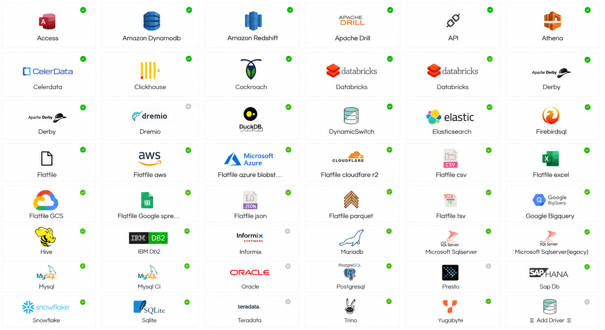

# Helical Insight

A Unified Open Source Enterprise Ready Embedded BI with AI Capabilities ~ providing all enterprise features in the open source free version.  

[](https://github.com/helicalinsight/helicalinsight/releases)
[](https://github.com/helicalinsight/helicalinsight/stargazers)
[](https://hub.docker.com/)
[](https://github.com/helicalinsight/helicalinsight/actions/workflows/maven.yml) [](https://github.com/helicalinsight/helicalinsight/issues)[](https://github.com/helicalinsight/helicalinsight/contributors)


[Helical Insight](https://www.helicalinsight.com/) is an open source embeddable BI product providing a unified BI experience which includes.
 - AI assisted chat driven analytics with option of bring your own LLM
 - Paginated pixel perfect printer friendly reports (similar to crystal reports, SSRS etc)
 - Interactive dashboards with drill down drill through and interactivity 

**Resources**

- 🌐 Website: https://www.helicalinsight.com/
- 📦 Installation: https://www.helicalinsight.com/helical-insight-docker-installation/
- 🚀 Getting Started: https://www.helicalinsight.com/getting-started-with-helical-insight/
- 💬 Forum: https://forum.helicalinsight.com/
- 🎥 Usage Videos: https://www.helicalinsight.com/videos/

## Concept Video Overview


## Demo 

Reach out for a personalized demo on support@helicalinsight.com


## Key Features
Helical Insight is designed for organizations that need a complete Business Intelligence and Reporting platform without compromising flexibility or scalability.

| Feature | Description |
|----------|-------------|
| 🤖 AI Analytics | Analyze data using natural language, generate SQL automatically, summarize reports, and uncover insights with [AI-powered analytics](https://www.helicalinsight.com/usage-of-instant-bi-in-helical-insight/) with agentic capabilities. |
| 📑 Paginated Pixel Perfect Reporting | Design professional paginated [pixel perfect reports](https://www.helicalinsight.com/helical-canned-reports-when-to-use/) suitable for invoices, MIS reports, financial statements, operational reports, and regulatory reporting. |
| 📊 Interactive Dashboards | Create highly [interactive dashboards](https://www.helicalinsight.com/dashboard-designer-version-5-0-getting-started/) with drill-down, drill-through, filters, KPI widgets, maps, charts, and advanced visualizations. |
| 🌍 Localization | Support for [localization](https://www.helicalinsight.com/localization-of-helical-insight/). |
| 📤 Multiple Export Formats | Export dashboards and reports to PDF, Excel, CSV, Word, HTML, JSON, XML, and more. |
| 🔗 Embedded Analytics | Seamlessly embed AI chatbot, dashboards, and paginated reports into web applications, SaaS platforms, customer portals, and enterprise applications. |
| 🎨 White Labeling | Fully customize logos, themes, colors, URLs, and branding for OEM and embedded deployments. [White Label Guide](https://www.helicalinsight.com/white-labelling/) |
| 👥 Multi-Tenancy | Support multiple customers or departments from a single deployment with complete data isolation. |
| 🔐 Enterprise Security | Row-wise, column-wise and table-wise data security based on logged-in user context. Supports JWT, Okta, Keycloak, OAuth and custom token-based SSO. [SSO Guide](https://www.helicalinsight.com/implementing-single-sign-sso-helical-insight-application/) |
| 📧 Scheduling & Report Bursting | Automatically [schedule reports and dashboards](https://www.helicalinsight.com/email-schedule-reports-and-dashboard/), deliver them via email, and distribute personalized reports. |
| 📈 Advanced Visualizations | Various chart types, maps, pivot tables and support for custom JavaScript visualizations. |
| ⚡ High Performance | Built-in caching, pagination, virtualization, load balancing, and clustering for enterprise-scale deployments. |
| 🔌 REST APIs | Extensive [REST API support](https://www.helicalinsight.com/helical-insight-api/) for automation and extension. |
| 🐳 Modern Deployment | Deploy on Windows, Linux, Docker, Kubernetes, cloud, on-premises, or hybrid environments. |
| 🛠 Developer Friendly | Extend using Java, JavaScript, CSS, HTML, Liquid Template Language, APIs, plugins, and custom workflows (HWF). |


## Supported Databases

Helical Insight connects to virtually any modern data source through native connectors, JDBC, REST APIs, and custom integrations. Users can also upload custom JDBC drivers and start using them immediately.

| Big Data & Analytics | Flat Files & Cloud Storage | RDBMS | NoSQL & Big Data | Advanced / Enterprise |
|---------------------|---------------------------|--------|------------------|----------------------|
| Amazon Athena | Flat File | Microsoft Access | Amazon DynamoDB | API |
| Amazon Redshift | AWS S3 Files | MySQL | CockroachDB | Databricks |
| Apache Drill | Azure Blob Storage | MySQL CI | ClickHouse | Databricks (Alternate) |
| ClickHouse | Cloudflare R2 | MariaDB | DuckDB | Dremio |
| Google BigQuery | CSV | PostgreSQL | Elasticsearch | DynamicSwitch |
| Apache Hive | Excel | Oracle Database | Apache Hive | Firebird SQL |
| Presto | Google Sheets | SQL Server | YugabyteDB | Informix |
| Trino | JSON | SQL Server (Legacy) | Snowflake | Custom JDBC Driver |
| Snowflake | Parquet | IBM DB2 |  |  |
| Teradata | TSV | SAP HANA |  |  |
|  | Google Cloud Storage | SQLite |  |  |



# Helical Insight Comparison with Modern Open Source BI Tools

We have covered in detail comparisons of Helical Insight with open-source BI platforms such as: **Superset**, **Metabase**, **Redash**, **Lightdash**

The comparison includes:

- Features
- Embedding
- SSO
- Row-Level Security
- Modules
- Reporting
- Dashboarding
- AI Features

For a more detailed comparison, refer to the blog : [Comparison link](https://www.helicalinsight.com/open-source-github-hosted-bi-tools-comparison/) 


---

# Helical Insight Comparison with Traditional Reporting Tools

We also compare Helical Insight with reporting-first tools including: **JasperReports**, **BIRT**, **Pentaho**, **Crystal Reports**

The comparison covers:

- Reporting capabilities
- Dashboarding
- Embedded analytics
- Security
- Scheduling
- Exporting
- Modern BI requirements

For a more detailed comparison, refer to the blog : [Comparison link](https://www.helicalinsight.com/helical-insight-vs-legacy-reporting-tools/) 


---

## Pick your path

| You want to… | Do this |
|--------------|---------|
| **Run the product** (no coding) | [Run Helical Insight](#run-helical-insight-zero-configuration) |
| **Contribute / develop** | [Developer setup](#developer-setup) |

Configuration is handled for you. End users copy one `.env` file and start Docker. Contributors run one setup script, then work on the component they care about.

---

## Run Helical Insight (zero configuration)

**Best path for downloads, demos, and anyone who just wants the app up.**

You need [Docker](https://docs.docker.com/get-docker/) and Docker Compose. Nothing else.

### From a Docker package (ZIP)

Download the [latest Docker package (ZIP)](https://github.com/helicalinsight/helicalinsight/releases/latest/download/helicalinsight-docker.zip)

1. Unzip the package and open the folder that contains `docker-compose.yml`.
2. Copy settings (defaults are fine on your own machine):

   ```bash
   cp .env.example .env
   # Windows PowerShell: Copy-Item .env.example .env
   ```

3. Start:

   ```bash
   docker compose up -d
   ```

4. Open **https://localhost** — login: `hiadmin` / `hiadmin`

### From this git repository

```bash
git clone https://github.com/helicalinsight/helicalinsight.git
cd helicalinsight

# One-time: link Instant BI + create docker/.env
./scripts/setup-dev.sh          # Linux / macOS
# .\scripts\setup-dev.ps1       # Windows PowerShell

cd docker
docker compose up -d
```

Open **https://localhost** — login: `hiadmin` / `hiadmin`

Full Docker guide (stop, logs, ports, updates): [docker/readme/readme.md](docker/readme/readme.md)

### First start takes a few minutes — that is normal

The **first** `docker compose up` is the slowest. Wait for containers to become healthy.

| What happens | Why it takes time |
|--------------|-------------------|
| Image pull / Instant BI build | Downloads images; builds Instant BI once if the local image is missing (deps baked into image) |
| App bootstrap | Tomcat starts; Chrome may install for export (`INSTALL_CHROME=true` by default) |

**How to know it is ready**

```bash
cd docker
docker compose ps          # wait until services look healthy / running
docker compose logs -f     # watch progress; Ctrl+C to stop following
```

Then open **https://localhost**. Later starts are much faster (images and Instant BI deps are cached).

**Optional speed tip (no PDF/export needed):** in `docker/.env` set `INSTALL_CHROME=false`, then restart.

| Username | Password | Role |
|----------|----------|------|
| `hiadmin` | `hiadmin` | Administrator |
| `hiuser` | `hiuser` | Standard user |

Change these credentials outside local/demo use.

---


## Developer setup

Goal: spend time on product work, not path/XML/env hunting. Run the shared setup **once**, then start only the stack pieces you need.

### What’s in this repo

| Component | Directory | Stack | Details |
|-----------|-----------|-------|---------|
| **Backend** | [`server/`](server/) | Java 25, Spring, Hibernate, Tomcat WAR | [server/README.md](server/README.md) |
| **Frontend** | [`client/`](client/) | React 17, Redux, Ant Design | [client/README.md](client/README.md) |
| **Instant BI** | [`ib/`](ib/) | Python, Flask, LangChain / LangGraph | [ib/README.md](ib/README.md) |

```
┌────────────┐     /hi-ee/*     ┌────────────┐     Instant BI API     ┌────────────┐
│  Frontend  │ ───────────────► │  Backend   │ ─────────────────────► │ Instant BI │
│  :3000     │                  │  :8080     │                        │  :8000     │
└────────────┘                  └────────────┘                        └────────────┘
```

### Recommended IDE

| Area | Recommendation |
|------|----------------|
| **Backend** | **[Eclipse IDE](https://www.eclipse.org/downloads/)** (Enterprise Java / Web) — best fit: add a Tomcat 11 server in Eclipse and run/debug the `presentation` WAR without manual copy-deploy |
| **Frontend** | VS Code, Cursor, or any Node-friendly editor |
| **Instant BI** | VS Code, Cursor, or any Python-friendly editor |

Other Java IDEs (e.g. IntelliJ IDEA) work, but **Eclipse + Tomcat** is the supported day-to-day path for the backend. Steps: [server/README.md — Eclipse + Tomcat](server/README.md#eclipse--tomcat-recommended).

### 1. Prerequisites (once)

| Tool | Version | Needed for |
|------|---------|------------|
| JDK | 25+ | Backend |
| Maven | 3.8+ | Backend |
| Node.js | 18+ | Frontend |
| npm | 9+ | Frontend |
| Python | 3.9+ | Instant BI (native) |
| Apache Tomcat | 11.x+ | Backend (native only) |
| Docker + Compose | recent | Fastest full stack / product run |

```bash
./scripts/check-prerequisites.sh      # Linux / macOS
# .\scripts\check-prerequisites.ps1  # Windows PowerShell
```

### 2. One-time repo setup (required)

Patches `hi-repository` paths for your machine, creates `.env` files, and links Instant BI into `docker/instantbi/helicalbi` (needed for Docker from a git checkout).

```bash
./scripts/setup-dev.sh      # Linux / macOS
# .\scripts\setup-dev.ps1  # Windows PowerShell
```

After this, you should not hand-edit install paths for normal local work.

### 3. Choose how you work

#### A — Full stack in Docker (recommended for most contributors)

Runs backend + Postgres + Nginx + Instant BI with minimal local tooling:

```bash
cd docker
docker compose up -d
# https://localhost  →  hiadmin / hiadmin
```

Build the **backend from source** instead of the published image:

```bash
docker compose -f docker-compose.dev.yml up --build
# http://localhost:8080/hi-ee/  →  hiadmin / hiadmin
```

#### B — Native: work on one component

Use this when you need a fast edit–reload loop on a single app.

<details>
<summary><strong>Backend</strong> — Eclipse + Tomcat (recommended) or WAR deploy</summary>

**Recommended:** use **Eclipse** with a Tomcat 11 server and deploy the `presentation` module as context `/hi-ee`. See [server/README.md — Eclipse + Tomcat](server/README.md#eclipse--tomcat-recommended).

Or build and deploy by hand:

```bash
cd server
mvn clean package -DskipTests
# Deploy as hi-ee.war so the context path matches the frontend:
# presentation/target/hi-ee-7.0.0.war  →  $CATALINA_HOME/webapps/hi-ee.war
```

Default Maven profile uses embedded Derby under `server/db/` (no Postgres install).  
Verify: `http://localhost:8080/hi-ee/`

More: [server/README.md](server/README.md)

</details>

<details>
<summary><strong>Frontend</strong> — React dev server (needs a running backend)</summary>

```bash
cd client
npm ci --legacy-peer-deps
npm run start18
# http://localhost:3000
```

Dev proxy defaults to `http://localhost:8080`. Start the backend (native Tomcat or Docker) first.

More: [client/README.md](client/README.md)

</details>

<details>
<summary><strong>Instant BI</strong> — Python service on port 8000</summary>

```bash
cd ib/helicalbi
python -m venv .venv
# Linux / macOS: source .venv/bin/activate
# Windows:       .\.venv\Scripts\Activate.ps1
pip install -r requirements.txt
cp .env.example .env    # defaults use stub LLM — no API key required
python app.py
# http://localhost:8000
```

Or let Docker run it as part of the compose stack (after `setup-dev`).

More: [ib/README.md](ib/README.md)

</details>

### Suggested day-to-day flows

| You’re changing… | Typical loop |
|------------------|--------------|
| UI only | Backend via Docker → `npm run start18` in `client/` |
| Java APIs / reports | Build & deploy WAR (or `docker-compose.dev.yml`) → hit API or UI |
| Instant BI / LLM | Run `ib/helicalbi` locally or Instant BI container → exercise from the product UI |
| Everything | `cd docker && docker compose up -d` |

### Tests

```bash
# Backend
cd server && mvn test

# Frontend
cd client && npm test

# Instant BI
cd ib/helicalbi && pytest -m "not llm"
```

CI graph: [`.github/workflows/README.md`](.github/workflows/README.md)

---

## Repository structure

```
├── client/                  # React frontend
├── server/                  # Java backend (Maven multi-module → hi-ee WAR)
│   ├── core/ adhoc/ export/ scheduling/ …
│   ├── presentation/        # WAR packaging → hi-ee-7.0.0.war
│   └── hi-repository/       # System config and templates
├── ib/helicalbi/            # Instant BI (Python)
├── docker/                  # One-command product run (users + contributors)
├── scripts/                 # setup-dev, prerequisite checks
├── docker-compose.dev.yml   # Build backend from source in Docker
└── README.md
```

> The WAR is built as `hi-ee-7.0.0.war` but must be deployed as `hi-ee.war` so the Tomcat context `/hi-ee` matches the frontend.

## Contributing

**Fork the repo → work on a branch → open a pull request.** See [CONTRIBUTING.md](CONTRIBUTING.md) for the full flow. Keep PRs focused; prefer product changes over one-off machine config commits (no secrets, no personal paths, no `.env`).


## 🚀 Start Building with Helical Insight Today

Whether you're creating:
- Executive Dashboards
- Enterprise Reports
- Embedded Analytics
- AI-Powered Business Intelligence

Helical Insight provides everything you need in one powerful platform.

⭐ **Star this repository if you find it useful.**

## Connect With Us

- GitHub: https://github.com/helicalinsight/helicalinsight
- Documentation: https://www.helicalinsight.com/guide/
- Community Forum: https://forum.helicalinsight.com/
- LinkedIn: https://www.linkedin.com/showcase/helical_insight/
- YouTube: https://www.youtube.com/@HelicalInsight
- Need help: support@helicalinsight.com
- Report Issues: [GitHub Issues](https://github.com/helicalinsight/helicalinsight/issues)