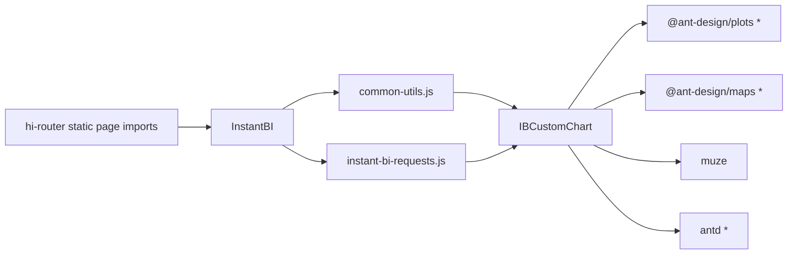

# Speed up InstantBI client build

Saved for later — do not treat as completed work until implemented.

**Overview:** The InstantBI client production build is slow mainly because of a huge eager module graph (star-imports of plots/maps/muze/antd), ESLint during every production build, and wasted source-map work in Terser/Babel despite webpack `devtool: false`. Fix with env flags first, then stop accidental heavy InstantBI chart imports from pulling the full chart stack into unrelated modules.

## Todos

- [ ] Set `GENERATE_SOURCEMAP=false` and `DISABLE_ESLINT_PLUGIN=true` on production build script/CI
- [ ] Move `IB_CHART_RENDER_ERROR` out of `ib-custom-chart`; update `instant-bi-requests` and `common-utils` imports
- [ ] Compare cold build times before/after env flags

## What’s slow

Production build is `npm run build` in `client/package.json` → `client/scripts/build.js` with `--max_old_space_size=5096` (already a symptom of an oversized compile).

Main cost drivers in `client/config/webpack.config.js`:

| Cause | Why it hurts |
|-------|----------------|
| Huge eager graph | `import * as Plots/Maps/Icons/Antd` + muze in `hi-instant-bi/components/ib-custom-chart.jsx` (same pattern in hreport custom chart) |
| ESLint on every prod build | `ESLintPlugin` runs unless `DISABLE_ESLINT_PLUGIN=true` (around lines 722–746) |
| Half-disabled source maps | `devtool: false` (around line 165) but `GENERATE_SOURCEMAP` defaults true (around line 35), so Terser/Babel/CSS still do source-map work |
| Eager routing | Pages (including InstantBI) are statically imported from the router — almost no `React.lazy` |
| Full Ant CSS at entry | `src/index.js` imports `antd/dist/antd.css` |

InstantBI chart-preferences / `ChartIcon` are **not** the heavy pull. The heavy InstantBI path is `ib-custom-chart.jsx`, which is also pulled in accidentally when only a string constant is needed:

```js
// instant-bi-requests.js — loads entire plots/maps/muze stack for one string
import { IB_CHART_RENDER_ERROR } from "../components/ib-custom-chart";
```



## Plan (concrete)

### 1. Production build env flags (highest ROI, low risk)

Update the `build` script in `client/package.json` so production builds skip ESLint and source-map generation:

```json
"build": "cross-env GENERATE_SOURCEMAP=false DISABLE_ESLINT_PLUGIN=true node --max_old_space_size=5096 scripts/build"
```

(or set the same vars in Jenkins before `npm run build`).

This aligns Terser/Babel/CSS with existing `devtool: false` and drops ESLint over ~1.4k JS files.

### 2. Stop accidental heavy InstantBI imports

- Move `IB_CHART_RENDER_ERROR` from `hi-instant-bi/components/ib-custom-chart.jsx` into a tiny constants file (e.g. `hi-instant-bi/utils/ib-chart-constants.js`).
- Update `hi-instant-bi/utils/instant-bi-requests.js` and `hi-instant-bi/utils/common-utils.js` to import the constant from that file.
- Keep `IBCustomChart` imported only from chart render sites (`ChartView` / preview), not from request helpers.

### 3. Measure before/after

- Time one cold `npm run build` before and after step 1.
- Optionally run `npm run analyze` / source-map-explorer after a build to confirm plots/maps/muze still dominate, then decide whether route-level `React.lazy` for InstantBI is worth a follow-up.

## Out of scope for this pass

- Replacing star-imports inside `ib-custom-chart` with dynamic per-chart `import()` (larger behavior risk for react-live scope).
- Full router lazy-loading of all pages.
- Migrating Webpack 4 → SWC / Webpack 5.

## Expected result

Step 1 alone should cut a large fraction of wall-clock time on Jenkins. Step 2 prevents request/error paths from forcing the full chart stack into more chunks and keeps InstantBI changes from making cold builds worse.

## Related Cursor plan

Also kept at: `C:\Users\HDEV064\.cursor\plans\speed_up_client_build_9f3b90ba.plan.md`
