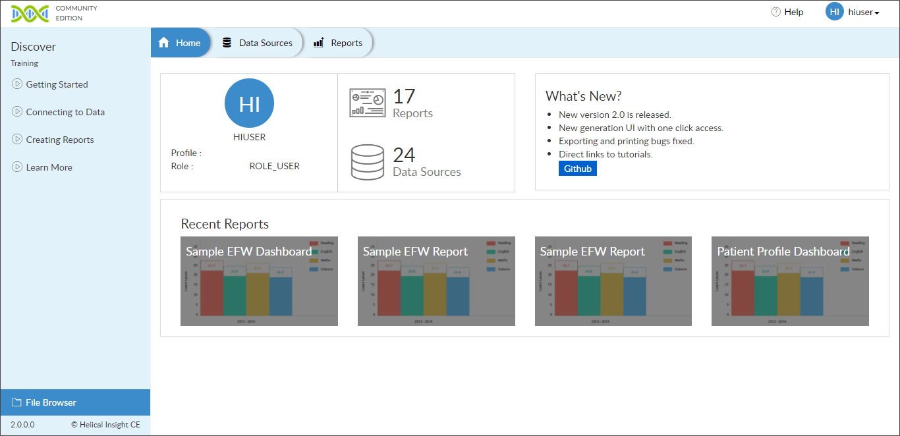
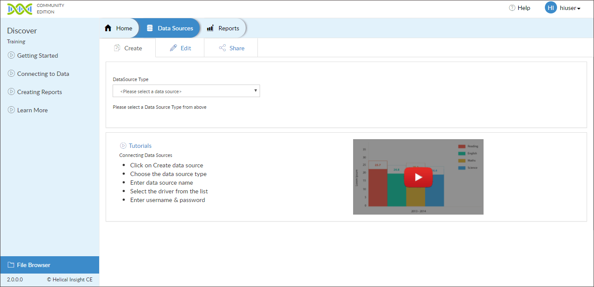
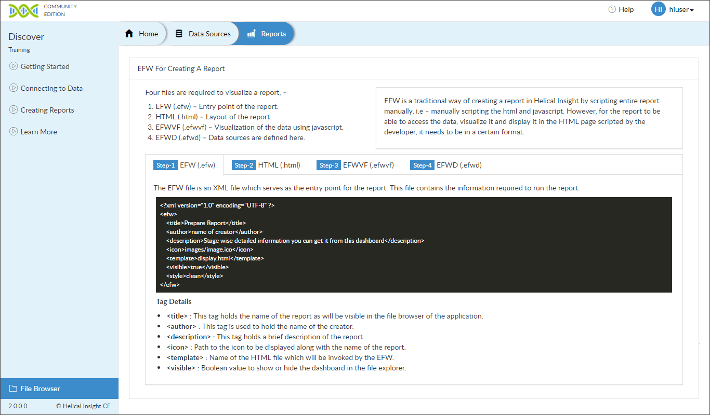
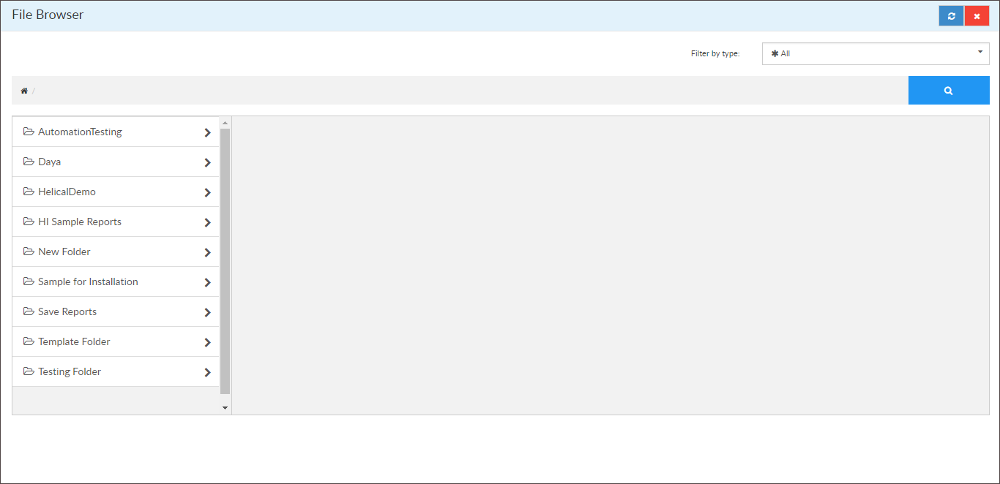
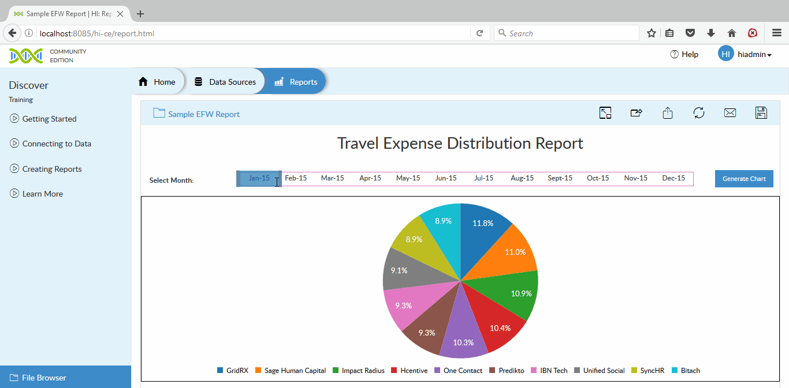
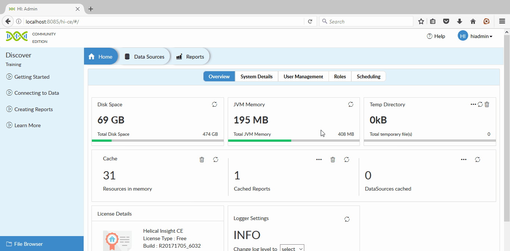

## Helical Insight

&gt; Community driven innovation via Helical Insight CE.

## What is it

Helical Insight is world's first Open Source Business Intelligence framework which can help you derive insights out of your one or multiple datasources. Helical Insight is having all the features which you generally expect out of any BI tool (be it open source or proprietary). Being a framework, Helical Insight is highly extensible via APIs and SDK, thus features can be extended whenever required without compromising on your business requirement.

Helical Insight also comes with a unique Workflow rule engine, allowing you to call any functionality of Helical Insight or external functionality and thus empowering you to implement any sort of custom business process.

Use HTML skillset and Java skillset to add functionalities at the frontend and backend respectively.

See the [Quick start](https://helicalinsight.github.io/helicalinsight/#/quickstart) for more details.

## Features

* New generation UI with one click access
* Backend EFW method of reports, dashboards and other data analysis creation
* User Role Management
* Exporting to Multiple Formats
* Email scheduling
* Data Security
* XML driven Workflow
* API Driven Framework
* Community Support
* Community Upgrades
* Direct links to tutorials
* Mobile & Cloud compatible
* Cache for faster Performance
* Compatible with All Modern Browsers

## Supported Databases

We support all the JDBC4 complaint databases, NoSQL, Big Data, RDBMS, Cloud db, Columnar database etc

#### RDBMS

* MySQL
* PostgreSQL
* SQL Server
* Oracle
* Firebird
* Informix
* Ingres
* MariaDB
* Presto
* Progress
* SQlite

#### NoSQL & Big Data

* Cassandra
* Druid
* HBase
* MongoDb
* Hive
* NuoDB
* Neo4j

#### Cloud

* Microsoft Azure SQL
* Amazon RedShift Database
* Google Cloud Sql

#### Flat Files

* CSV
* TSV
* JSON

## How to build ?

Prerequisite:

To build Helical Insight Community Edition project you need

* `Maven 3` or higher version installed.
* `JDK 7` or higher version installed.
*  Apache tomcat 7 or 8 should be installed.
*  Use Mysql 5.7 or higher version.

 `NOTE: In case database is not accessed remotely then grant all priviledges to user.`

*  Database with name `hice` to be created in Mysql.

Steps:

1. Download the Helical Insight project from Helical Insight Github Page.

2. Find the `hikaricp`, `tomcat-jdbc` jar files in the resources folder at `<project-path>\helicalinsight-master\resources` and then install it locally in your maven repository using command:

		a. mvn install:install-file -Dfile={path/to/file} -DartifactId=HikariCP -Dversion=2.4.7-hi -Dpackaging=jar

		Example: mvn install:install-file -Dfile=E:\helicalinsight-master\resources\HikariCP-2.4.7-hi.jar -DgroupId=com.zaxxer -DartifactId=HikariCP -Dversion=2.4.7-hi -Dpackaging=jar

		b. mvn install:install-file -Dfile={path/to/file} -DgroupId=org.apache.tomcat -DartifactId=jdbc-pool -Dversion=7.0.65 -Dpackaging=jar

		Example: mvn install:install-file -Dfile=E:\helicalinsight-master\resources\tomcat-jdbc-7.0.65.jar -DgroupId=org.apache.tomcat -DartifactId=tomcat-jdbc -Dversion=7.0.65 -Dpackaging=jar

3. Change the  below variables in the `pom.xml` present at location `<project-path>\helicalinsight-master\hi-ce` folder for configuring HI Repository , Log Location and Database credentials of the `hice` database.

Where:

a)`<systemDirectory>` : This is the Helical Insight Report repository path , which contains all created reports and dashboards i.e. `<project-path>\helicalinsight-master\hi-repository`.

b)`<logLocation>` : Location of Helical Insight Application log file i.e, `<project-path>\helicalinsight-master\hi-repository\System\Logs`.

c) Database credentials like   

```text
	<dbUser>DBUsername</dbUser>
	<dbPassword>DBPassword</dbPassword>
	<dbServer>DBName<dbServer>
	<dbPort>DBPort<dbPort>
```
								   
d)`<dbName>`: The `hice` database which will store users/roles/profile information 

Please refer the below example to do changes for `production environment` in pom.xml file 

```text
	<systemDirectory>path/to/SystemDirectory<systemDirectory>
	<logLocation>path/to/log/folder<logLocation>
	<dbUser>database-user-name<dbUser>
	<dbPassword>database-password<dbPassword>
	<dbServer>database-server-host<dbServer>
	<dbPort>database-port<dbPort>
	<dbName>hice<dbName>

	eg:
	<systemDirectory>E:/hi-repositorysystemDirectory>
	<!--This is the path which points to the hi-repository folder present with the download--&gt;
	<logLocation>E:/logs<logLocation> <!--log location--&gt;
	<dbUser>hiuser<dbUser>
	<dbPassword>hiuser<dbPassword>
	<dbServer>localhost<dbServer>
	<dbPort>3306<dbPort>
	<dbName>hice<dbName>
```

4.Do following changes in `Setting.xml` configurations :

	a) Open the Helical Insights setting.xml file present at below location

		Location: <project-path>\helicalinsight-master\hi-repository\System\Admin\

    b) Find the <efwSolution> tag and change the value to your hi-repository path like :
	   <efwSolution><project-path>\helicalinsight-master\hi-repository</efwSolution>

    c) Find the <BaseUrl> tag and change the value with your base url

		Format for base URL is:

		http://<ip_address>:<port_no>/hi-ce/hi.html

		Example:<BaseUrl>http://localhost:8080/hi-ce/hi.html</BaseUrl>
		

5.To view sample reports of hi-repository , import Sample Travel Data in your mysql database, present in github at location `helicalinsight/db-dump/SampleTravelData.sql`.

6.Update database details in sample reports in below files :

    <project-path>\helicalinsight-master\hi-repository\Sample Reports\Sample EFW Dashboard\sample_dashboard.efwd
    <project-path>\helicalinsight-master\hi-repository\Sample Reports\Travel Dashboard\travel_dashboard.efwd
	
	
	<DataSources>
        <Connection id="1" type="sql.jdbc">
            <Driver>com.mysql.jdbc.Driver</Driver>
            <Url>jdbc:mysql://192.168.2.9:3306/SampleTravelData</Url>
            <User>devuser</User>
            <Pass>devuser</Pass>
        </Connection>
    </DataSources>
	
	where ,
	<Driver> : Name of database driver.
	<Url>    : Database connection URL with dbhost,database name as SampleTravelData.
	<User>   : Username of database.
    <Pass>   : Password of database.

7.Run the below command according to environment which builds the Helical Insight Community Edition project and creates the `hi-ce.war` file in target folder `<project-path>\helicalinsight-master\hi-ce\target`.


  Go to the Helical Insight project location and run the following command : 

```text 
		For Dev Environment

		mvn clean package -Denv=dev

		For Production Environment

		mvn clean package -Denv=production
```

8.Now Deploy the application on any webserver like Apache tomcat and access the application using above mention url.

    http://<ip_address>:<port_no>/hi-ce/hi.html

Example: http://localhost:8080/hi-ce/hi.html

## Directly deploy
You may also directly deploy the `hi-ce.war` file in the application server from the `hi-ce/target` module
You need `tomcat` or any other server. Please follow the instructions given [here](https://helicalinsight.github.io/helicalinsight/#/quickstart?id=manual-installation)

## Application Screenshots









#### Sample Report

#### Admin Page


## Examples

Check out the Demos to Helical Insight in use.

* [Industry specific demo](http://www.helicalinsight.com/industry-specific-demo/)

* [Job functions specific demo](http://www.helicalinsight.com/job-functions-specific-demo/)

* [Miscellaneous Use Cases](http://www.helicalinsight.com/miscellaneous-use-cases/)

## Try Enterprise Edition

Helical Insight Enterprise Edition comes with many addon features like self-service interface for reports and dashboards creation, multi tenancy, machine learning and NLP, UI driven workflow etc.

Try Now [Download Free Trial.](http://www.helicalinsight.com/register/)

## License

Copyright (c) Helical Insight. All rights reserved.

Licensed under the Apache License.