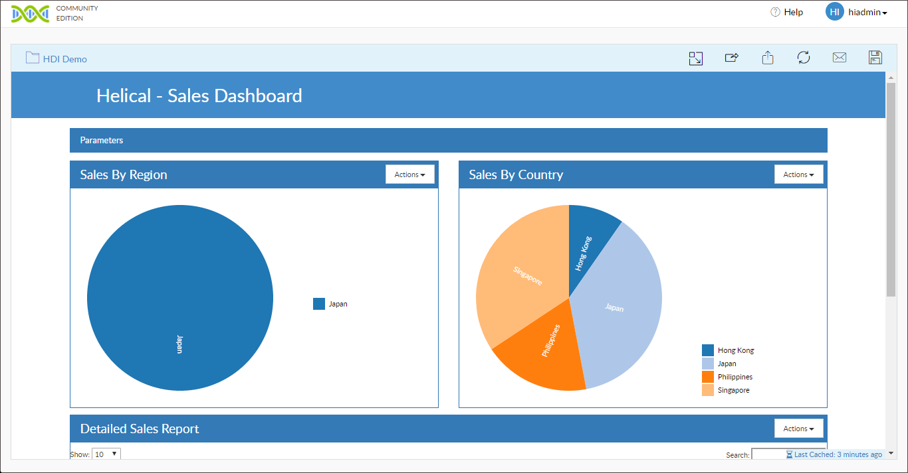
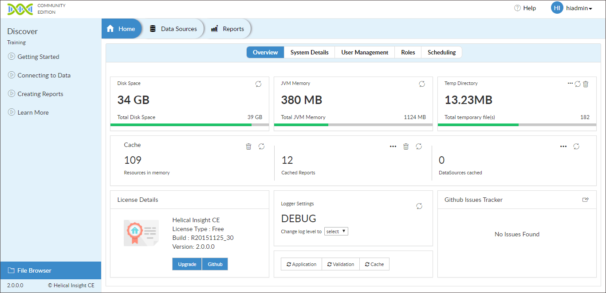

## Helical Insight

> Community driven innovation via Helical Insight CE.

## What is it

Helical Insight is the World's first Open Source Business Intelligence framework which can help you derive insights out of your one or multiple datasources. Helical Insight is having all the features which you generally expect out of any BI tool (be it open source or proprietary). Being a framework, Helical Insight is highly extensible via APIs and SDK, thus features can be extended whenever required without compromising on your business requirement. 

Helical Insight also comes with a unique Workflow rule engine, allowing you to call any functionality of Helical Insight or external functionality and thus empowering you to implement any sort of custom business process.

Use HTML skillset and Java skillset to add functionalities at the frontend and backend respectively.
  
See the [Quick start](quickstart.md) for more details.

## Features

* New generation UI with one click access
* Backend EFW method of reports, dashboards and other data analysis creation
* User and Role Management
* Export Reports in Multiple Formats
* Emailing and Scheduling Reports
* Data Security
* XML driven Workflow 
* API Driven Framework
* Community Support
* Community Upgrades
* Direct links to tutorials
* Mobile & Cloud compatible
* Cache for faster Performance
* Compatible with All Modern Browsers

## Supported Databases

* Mysql
* PostgreSQL
* SQL Server
* Oracle
* Firebird
* Informix
* Ingres
* MariaDB
* Presto
* Progress
* SQlite
* MongoDb
* Hive
* NuoDB
* Neo4j
* Druid
* Amazon RedShift Database
* Google MySQL Cloud
* db2
* csv

## Application Screenshots

 

 

 

 

  
#### Sample Report
 
#### Admin Page
  

## Examples

Check out the Demos to Helical Insight in use.

* [Industry specific demo](http://www.helicalinsight.com/industry-specific-demo/) 

* [Job functions specific demo](http://www.helicalinsight.com/job-functions-specific-demo/) 

* [Miscellaneous Use Cases](http://www.helicalinsight.com/miscellaneous-use-cases/) 
 

## Try Enterprise Edition

Helical Insight Enterprise Edition comes with many Add-ons features like self service interface for reports and dashboards creation, multi-tenancy, machine learning and NLP, UI driven workflow etc.

Try Now [Download Free Trial.](http://www.helicalinsight.com/register/)

## License

Copyright (c) Helical Insight. All rights reserved.

Licensed under the  Apache License.
