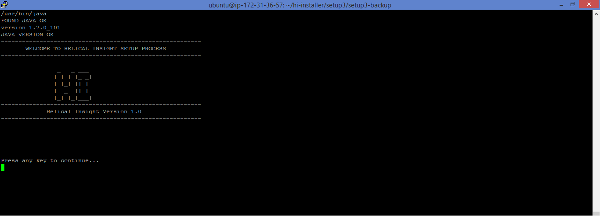

## Windows

On downloading the Helical Insight installer file, following are the steps to install the application. During installation please select an empty folder. 


##### Prerequisites :
* Java version `1.8` or higher
* User should have `administrator privilege`.
* If multiple Java versions are installed, then the user need to set `JRE_HOME` / `JAVA_HOME` environment variables [learn to set environment variables ](http://www.helicalinsight.com/technical-guide/configure-java-environment-variables/)
* The RAM should be minimum of `500 MB` or higher

##### Steps :
1. Run the Helical Insight file as an Administrator
2. Choose I accept the agreement, then click Next

	

3. Read About HI, then click Next.

	

4. Enter System Information details like `Database Port`, `Application Port` and `Application context Name`, then click Next. 

	###### Application Context Name :	The name entered here will be used to access the application on browser. For example in the below image context name is `hi`, hence in browser the application will be accessed by that name. 

	

5. Now, fill the details for Email Configuration like `Email User Name`, `Email Password`,`Email`,`Email Port Number` and `Email Host Name`. 
##### For Example:
```text
Email user name : user@company.com
password : helical005
port=587
from= no-reply@company.com    // can be changed as required
hostName : mail.company.com
```

	

6. Select Destination location to install Helical Insight files then click Next. It would be recommended to have atleast `2 GB ` of free space.  

 !> NOTE: Please ensure you select an empty folder during installation.

	

7. Now it is ready to install, click Install and wait till finish.

	

8. Installation is in progress.

	

9. Click on Finish to complete installation 

	

10. HI application will launch in your default web browser. 

	
	
#### Enter the provided credentials to login.
Following are the Default userid and password:

```text
For Admin :: hiadmin / hiadmin
For super user :: hiuser / hiuser
```


## Linux

Following are the steps to install a Helical Insight Binary on a Linux Machine.

##### Prerequisites :
* Java version `1.8`
* The user should have `root permission`
* The RAM should be minimum of `500 MB` or higher 

##### Steps :
1. Open the terminal, execute the installer file using `./` .If the file does not have executable permission then use the following command `chmod +x hi-linux.run` 
2. After successful extraction, a welcome screen will appear 

	
	
3. Then a Prerequisite Message will appear .

	
	
4. Read the Product Information.

	
	
5. Read the End User Licence Details 

	
	
	
6. The user should agree to the license by pressing Y key.

	
	
7. The user is prompted to give the installation directory.

	

8. Enter the `hostname`, `email-port`, `email-address`,`username` and `password` as a part of the configuration setup. 

	
	
 !> The email configuration can be set or skipped as part of installation. 
 
9. Finally, the installation get finished. 

10. Once the installation completes, the application starts at `port[8080]` default or whichever is set by the user. 

#### Enter the provided credentials to login.
Following are the Default userid and password:

```text
For Admin :: hiadmin / hiadmin
For super user :: hiuser / hiuser
```


## Mac
