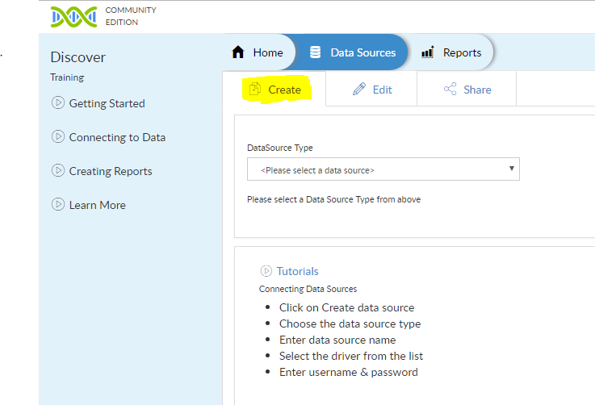
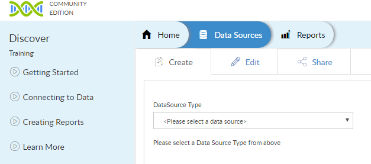
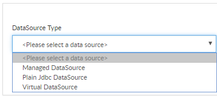
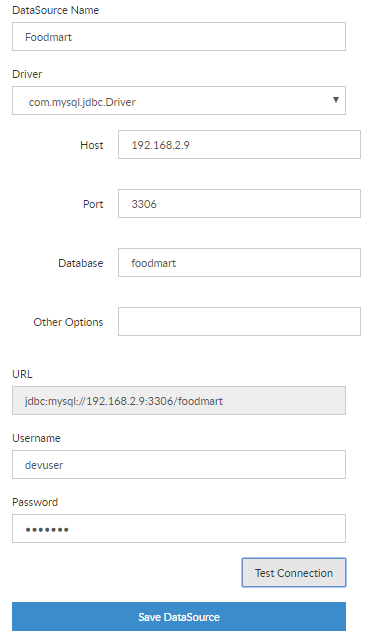

# Connecting to a Data Source

In this article you will learn about the usage of Datasource.  
To perform any operation on the database user has to define a datasource which contains list of tables.

There the two types of operations user can perform using Helical Insight (HI) which are:

1. Create a Datasource
2. Edit Datasource information

#### Creating Datasource

For creating a datasource user has to click on Data Source. Refer to the below snapshot

Step 1 : Click on `Data Sources` Tab, 
 From here you can navigate to `Create`, `Edit`, `Share` Datasources

Step 2 : Select the `DataSource Type`

 * `Managed Datasource`  : This uses connection pooling feature i.e the datasource is created once and used subsequently. This can be used to connect Mysql, Oracle and other jdbc compliant databases 
 
 * `Plain JDBC Datasource`         : This uses direct jdbc connection mechanism.
 
 * `Virtual Datasource`  : This is helpful when multiple database are to be connected at the same time and data analysis needs to be done eg. `MongoDb` and `Mysql`, `Mysql` and `Csv` etc

Step 3 : Enter `DataSource Name` and Select `Driver Details` 

 Here we have choosen `Managed Datasource` options and selected `Mysql Driver`.
 
 

Step 4 : Other necessary details are required to be entered which includes `Host Name`, `Port Number` and `Database Name` which will help user to connect the database.

On clicking `Test Connection`, user can also check whether the entered credentials are correct or not. Then click on Save Datasource. 

##### Editing Datasource: If a user wants to modify existing information of datasource, then Edit datasource is used. Typical use cases are when the database credentials have changed, then the same needs to be changed here so that the created reports and dashboards continues to work.

##### Following are the steps required to edit datasource : 

Step1: Click on `Datasource` Tab, then click `Edit`. 

Step2: Select `DataSource Type`.

Step3: User can then select the datasource on which the user intends to make the changes.

Step4: On selecting the datasource, user will have option to update any information. 

Step5: After updating, user can use `Test Connection` to verify the new details. Then Click `Update DataSource` to confirm.

