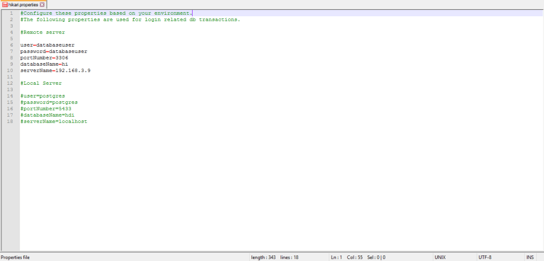

# Quick start

It is recommended to install Helical Insight Community Edition from official website.

[Download Helical Insight Community Edition Here](http://www.helicalinsight.com/helical-insight-ce/)

## Product Details

```text
Product Name	  	: Helical Insight
Product Type	  	: Business Intelligence Framework
Product Edition	   : Community
Version	           : 2.0.0.0
Build No.	         : R20170511_5973
License Type	      : Apache Version2
```

## Minimum System Requirement

```text
RAM	            : 4GB 
JVM Memory	     : 2GB 
Disk Space	     : 10GB
Cores              : 2 Cores   
```

## Supported Platforms

### Supported OS and Browsers

```text
OS Family    : Windows, Linux, Mac 

Browser Name : Google Chrome, Firefox, Internet Explorer, Microsoft Edge, etc.


```

## Helical Insight Installation


Please refer to the below tutorial to understand how to install helical insight


## Manual Installation

##### Manual Installation Guide For Binary Helical Insight War File


This Installation Guide will help user to manually configure the necessary settings required to install Helical Insight Application to the user’s system. This configuration is applicable to any Operating System (Windows family, Linux flavours, MacOS), any Databases (Relational, Columnar, Graph, Flatfiles, NOSQL ) user is using.

##### Prerequisites :
* Java version `1.7` or higher
* User should have any database management system installed like `MySQL`
* User should have any  server like `Tomcat`, `Jboss`, etc. up and running.

In order to run Tomcat or any other application server you may need to set `JAVA_HOME` or `JRE_HOME` based on your environment.
[learn to set environment variables ](http://www.helicalinsight.com/technical-guide/configure-java-environment-variables/)

##### The download contains the following directories and files :
* hi-repository
* Third Party Licenses
* db-dump
* hi-ce.war

	
	
##### NOTE :
1. These instructions use the windows file path convention `'\'`
	* For example:  C:\hi-ce\hi-repository  
2. If you are running on linux, please use the convention `'/'` wherever applicable.
	* For example :  /home/hi-ce/hi-repository
	
##### Steps :
1. Install the sql file `db.sql`, and `SampleTravelData.sql` present in db-dump folder. This contains the database required for `hi-ce` application and sample reports.

	```text
	*\db-dump\SampleData.sql
	*\db-dump\db.sql
	```
     
2. Edit the file setting.xml present in the hi-repository

	```text
	*\hi-repository\System\Admin\setting.xml
	```	 
	
    2.1 Find the tag `<efwSolution><\efwSolution>`. By default there is no value.  

     

    2.2 You need to set the value to the `INSTALLATIONPATH\hi-ce\hi-repository` (“C:\\hi-ce\\hi-repository”)  

	 
	
    2.3 For Windows: If you have copied the `hi-ce` folder in `D:` drive then <efwSolution>D:\\\\hi-ce\\\\hi-repository</efwSolution>

 !>NOTE: Please make sure the path separator is “\\\\” and NOT “\”
 
   For Linux:   If you have copied the hi folder in `/home/user` drive then
   `<efwSolution>/home/user/hi-ce/hi-repository</efwSolution>`

   Find the tag `<BaseUrl><\BaseUrl>`. By default there is no value. You need to set this value to the ip/domain configuration along with the hi path. 
	For example, if you have placed the tomcat in www.yourdomain.com/hi then the base URL will be `<BaseUrl>http://www.yourdomain.com/hi-ce/hi.html<\BaseUrl>`
	In case of IP based configuration the above may be your format:   `http://<yourip>:<port>/hi`

	* Example: `<BaseUrl>http://192.168.2.1:8080/hi-ce/hdi.html<\BaseUrl>`
	
3. For Editing the connection details:

	3.1. Go to `*\hi-ce\hi-repository\System\Admin`.
    
	3.2. Open `globalConnections.xml`
	
    3.3. Inside the file, find the element `<hikariDataSource>`, then find these tags `<jdbcUrl>`, `<userName>`,`<password>`.    Also, you can configure the default value for these tags based on your settings.
	
	 
	
	Here, you need to set the database URL and port number to make the sample report run. 
	
     
	
  !>NOTE: This can also be done using hi-ce application by editing the datasource connection.

4. Make sure that Tomcat (or any other application server you have) is up and running, then follow below steps. Copy `hi-ce` war file to
    `{TOMCAT-HOME}\webapps` folder. After a few seconds, you can see Tomcat has created one folder with the same name as that of the copied war file. For example, after deploying hi-ce.war file, a folder with name hi-ce would have been created in the same location.		
		
5. In case of linux environment one needs to have write permissions to change the files that we are going to discuss now. Open              `{TOMCAT_HOME}\webapps\hi-ce\WEB-INF\classes\project.properties` file with any text editor.		
 5.1. Find `settingPath` parameter and replace it with the location of `setting.xml` which is present in System directory.
     Format:    settingPath = {setting.xml Location}
     Example:   settingPath = D:\\hi-repository\\System\\Admin\\setting.xml 

      

     Description: This parameter indicates location of `setting.xml` file, which comes under hi-repository directory. This setting.xml file consists   of helical insight server settings.	

 5.2. Find schedulerPath parameter and replace the default value with a value where you want the application to store scheduling related data. 
     Format:schedulerPath = {scheduling.xml location}
     Example:schedulerPath = D:\\hi-repository\\System\\scheduling.xml 

     

     Description: scheduling.xml file contains information of scheduled reports and related data.

 5.3. The same way as described above, change the value of pluginPath parameter to a directory named Plugins inside System directory.
    Format:pluginPath = {Plugins location}
    Example: pluginPath= D:\\EFW_hdidev\\System\\Admin\\Plugins

     

 !>Note: Configuring this parameter is optional.
  
6. Set Log file location 

 6.1 Open `{TOMCAT_HOME}\webapps\hi-ce\WEB-INF\classes\log4j.properties` file in any text editor.
 
 6.2 Find `log4j.appender.file.File` parameter
 
 6.3 Replace the default value with `log4j.appender.file.File={Location where you want place the logs of the application}`
 
    Example: `log4j.appender.file.File=D:\\hi-repository\\System\\debugLogs.log`
	
	
  
7. Configure Database connections

  7.1. Open `{TOMCAT_HOME}\webapps\hi-ce\WEB-INF\classes\hikari.properties` file in any text editor.
 
     
	
 7.2. Configure your database, which the application (hi-ce) is going to use to store and retrieve the user credentials i.e. the credentials of users who will use this application. The same database will also be used to enhance the application’s performance to store caching related information.
 
 7.3. Create a schema named `‘hice’` with access to a user and configure the credentials as shown below:
 
	```text
	user=username
	password=password
	portNumber=3306
	databaseName=hice
	serverName=192.168.2.9
	```
	Where,
	* localhost – the serverName – You can replace it with your IP if you are deploying on a server
	* hice – The schema name that will be used to create (or use) a database in MySQL (you may wish to change name)
	
	```text
	username - MySQL username
    password - MySQL user's password
	```
	* These details are used by the application to store details for internal use.
	
  !> NOTE: You can also configure database connection pooling (mentioned below), which the application is going to use for login related connection  pooling. If you don’t know what you are doing, leave the defaults.
  
8. The configuration shown below also configures the Hibernate dialect for the database you are using incase of  MySQL as the database. If you are using some other database, please contact Helical for further assistance. Here configurations are shown for MySQL.
  * Open `{TOMCAT_HOME}\webapps\hi-ce\WEB-INF\application-context.xml` file with any text editor.  

    
 
  * Example:
  
      ```text
        <bean id="dataSource" class="com.zaxxer.hikari.HikariDataSource" destroy-method="close">
        <property name="maximumPoolSize" value="10"/>

        <!--Note that increasing the connectionTimeout may be required in case of slow network
        connections-->
        <property name="connectionTimeout" value="180000"/>

        <property name="minimumIdle" value="1"/>
        <property name="poolName" value="loginPool"/>
        <property name="maxLifetime" value="3600000"/>
        <property name="connectionTestQuery" value="SELECT 1"/>

        <!--MySQL datasource for HikariCp. If you choose some other database, relevant
        datasource configuration need to be put here-->

        <property name="dataSourceClassName" value="com.mysql.jdbc.jdbc2.optional.MysqlDataSource"/>
        <property name="dataSourceProperties" ref="dataSourceProperties"/>
        </bean>

        <bean id="sessionFactory" class="org.springframework.orm.hibernate3.LocalSessionFactoryBean">
        <property name="dataSource" ref="dataSource"/>
        <property name="configLocation" value="WEB-INF/hibernate.cfg.xml"/>
        <property name="configurationClass" value="org.hibernate.cfg.AnnotationConfiguration"/>
        <property name="hibernateProperties">
            <props>
                <!--Hibernate dialect for MySQL. For others, see Hibernate documentation-->
                <prop key="hibernate.dialect">org.hibernate.dialect.MySQLDialect</prop>
                <prop key="hibernate.hbm2ddl.auto">update</prop>
            </props>
        </property>
        </bean> 
        ```
	
	Here the two property values
	
	```text
	<property name="dataSourceClassName" value="com.mysql.jdbc.jdbc2.optional.MysqlDataSource"/>
	```
	and
	
	```text
	<prop key="hibernate.dialect">org.hibernate.dialect.MySQLDialect</prop>
	```
	need to be changed to the respective database specific values if you are using any other database other than MySQL.

    !> IMPORTANT NOTE: In case of linux environment, you may have to consider the following notes.
     * Tomcat user should have R\W access on the war file.
     * Tomcat user should have R\W access on the hice ‘hi-repository’ directory.

     Following the above steps complete the installation of the helical insight server. Restart your application server(Preferred) or reload the hi application in your application server manager. After that, you should be able to use the application by opening the browser and accessing at the
     ```text
     URL:  http://{Your Server}:{Port}/hi-ce/hdi.html 
     ```
     * For example: http://192.168.2.1:8080/hi-ce/hdi.html

     By default a user base with an organization called “Super Organization” that has two users hiadmin, hiuser is created.

 ##### Default User Credentials :
 ```text
  1.username: hiadmin
    password: hiadmin

  2.username: hiuser
    password: hiuser
 ```

 In case of issue in installing the software, reach out to us at support@helicalinsight.com  
  
    
 
		
		


