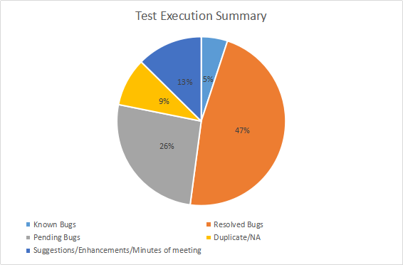
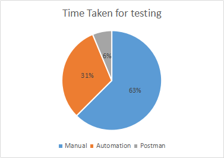
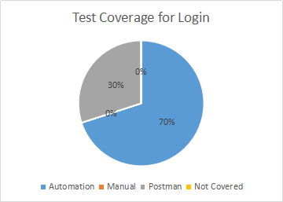
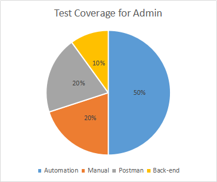
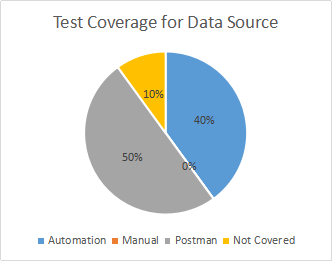
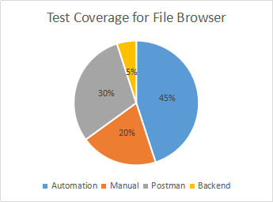
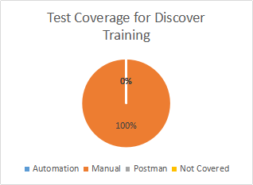

# Test Coverage for Helical Insight

## Testing approach

```text
Approach Name      : Unit Level
Tested/Not Tested  : Tested
Through			: JUnit
Owner			  : Dev Team

Approach Name      : Module Level
Tested/Not Tested  : Tested
Through			: JUnit , Manual
Owner			  : Dev Team

Approach Name      : Integration Level
Tested/Not Tested  : Tested
Through			: Combination of Manual, Automation and Postman
Owner			  : Testing Team

Approach Name      : System Level
Tested/Not Tested  : Tested
Through			: JUnit
Owner			  : Testing Team

Approach Name      : User Acceptance
Tested/Not Tested  : Tested
Through			: Combination of Manual, Automation and Postman
Owner			  : Testing Team, Dev Team and Others

Approach Name      : Beta Testing
Tested/Not Tested  : Tested
Through			: JUnit
Owner			  : Testing Team, Dev Team and Others

Approach Name      : Functional
Tested/Not Tested  : Tested
Through			: Combination of Manual, Automation and Postman
Owner			  : Testing Team

Approach Name      : Regression 
Tested/Not Tested  : Tested
Through			: Combination of Manual, Automation and Postman
Owner			  : Testing Team

Approach Name      : Re-test
Tested/Not Tested  : Tested
Through			: Combination of Manual, Automation and Postman
Owner			  : Testing Team

Approach Name      : Usability
Tested/Not Tested  : Tested
Through			: Combination of Manual, Automation and Postman
Owner			  : Testing Team

Approach Name      : Load
Tested/Not Tested  : Not Tested

Approach Name      : Performance
Tested/Not Tested  : Not Tested

Approach Name      : Security
Tested/Not Tested  : Not Tested

Approach Name      : Source Code Review
Tested/Not Tested  : Tested
Through			: Manual
Owner			  : Project Owner, Dev Team and Testing Team
```

## Test Execution Summary 
Automation , Manual & Postman

```test
Number Of test cases  : 1000 approx
Identified issues    : 119
```

 


## Time taken for testing
Automation , Manual & Postman

 

## Module wise Test Coverage 
Automation , Manual & Postman

## Login Module

* Login and Logout

 1. Automation Coverage :
 
    * Verify Elements present in Login page(Logo , Moto, text fields, button) 
    * Validating `Login` button functionality with valid and invalid credentials. 
    * Verified Login with `default user` and `default admin`.
	* Verified landing page after Login.
    * Logout.
    * URL Authentication for Login

 2. Manual Coverage :
 
    * No manual effort.

 3. Postman Coverage:
 
    * Checked Login functionality with valid and invalid credentials. 
    * Verified Login with default user and default admin .
    * Logout.
	
 
 

## Admin Module

* Home page :

 1. Automation Coverage :
 
    * Verified `Overview` tab and its element then refresh button functionality on `JVM Memory`, `Temp Directory`, `Cache`, `Cached Reports`, `DataSources cached` .
    * Click on Application , Validation and cache Refresh buttons.
    * Selecting different `Logger Settings` and Click on Refresh button .
    * Verified `System Details` tab and its refresh button functionality .
    * Verified `User Management` tab , by adding user , refresh button functionality of user page, search user with mail, user, roles, show no. of entries 5, 10, 25.. etc , Next and Previous buttons , edit user by Edit Email, Password, Add Role, Change Role Add Profile, Edit Profile and then delete user.
    * Verified `Roles` tab, by creating role and deletion , refresh functionality of roles page , search roles , show no. of entries 5,10,25 etc , next and previous buttons.
    * Verified `Scheduling` tab, Pause All, Start, Resume All, Shutdown and available First individual job Delete, Pause and Resume and Execute and more details link.
    * Help link.

 2. Manual Coverage :
 
    * Check logger settings for different log level.
    * Check deleted user after deleting it .
    * Check whether the scheduled jobs expires after the specified date and time .

 3. Postman Coverage:
 
    * Verified the functionality of Refresh button on `JVM Memory`, `Temp Directory`, `Cache`, `Cached Reports` and `DataSource cached`.
      Application , Validation and Cache Refresh buttons.
    * Verified system details tab and its refresh button functionality .
    * Verified User management , adding User , refresh functionality of user page, search user with email, user, roles, show no. of entries 5,10,25 etc , next and previous buttons , edit User and delete User.
    * Create Role , refresh functionality of roles page , search created roles , show no. of entries 5,10,25 etc , next and previous buttons and then finally Delete Role.
    * Verified scheduling tab , Pause All, Start, Resume All, Shutdown, individual jobs delete, pause and resume and execute.

 4. Back-end Coverage:
    * Check OS details and JVM thread details.
	
 
 
 
## User Module

* Data Source 

 1. Automation Coverage:
 
    * Verified Create , Edit , Share DataSource tabs . 
    * Verified links for tutorials .
    * Create data source : `data source type`, `advance data source type` , `data source name` , `driver`, `test connection` and save data source. 
    * Edit data source : `data source type` , search `data sources` created and `test connection , edit previously created data source .
    * Share data source : `data source type` and share with user.

 2. Manual Coverage :
 
    * No manual effort.

 3. Postman Coverage:
 
    * Create data source : `data source type`, `advance data source type` , `data source name` , `driver`, `test connection` and save data source. 
    * Edit data source : `data source type` , search `data sources` created and `test connection` , edit previously created data source .
    * Share data source : `data source type` and share with user.
 
 4. Not covered :
    * Create virtual data source.
    * Reports tab
 
  
  
* File Browser : 

 1. Automation Coverage :
 
    * Open File Browser and Checked filter by type.
    * Searched a folder/report.
    * Checked context menu functionality on a folder/report such as rename , delete , import , cut , paste , open and open in new window.
    * Verify Refresh File Browser and `Show all properties` button .
    * After opening a report , verified preview report,open in new window , Export, Refresh, Email , Schedule and save report.
    * Export/Email/Schedule report with selected parameters
    * New Window operations such as Export and Cache Refresh.
    * Export through URL in New Window and same with selecting parameters
    * Sharing EFW/EFWSR files with other user 
	* Close file browser.

 2. Manual Coverage: 
    * check path for folder and reports saved in file browser(It is also automated). 
    * After a report is mailed , check the content of attachments , subject , body of mail and receipts . 
	* After exporting a report check the content of PNG,JPG, PDF and EXCEL.
    * After scheduling a report check the content of report formats . 
	* Schedule expire functionality.
    * Import .crt file into File Browser
    * Schedule Management : More details  

 3. Postman Coverage:
    * Searched a report.
    * Checked content menu functionality such as open, open in new window,rename , delete , import , cut , paste and export
    * After opening a report, export, refresh,email , schedule , save report.
 
 4. Back-end Coverage:
    * Scheduler.xml file- check report properties fields such as name , last modified and type.
	
 
 
## Discover Training 

Everything in this section is verified manually.

 
 
* Uncovered Features/Don’t know :

    * Overview tab :: Logger Settings -- Selecting ‘change log level to’ usage  
    * Overview tab :: DataSources Cached Scenario (list update) 
    * Overview tab :: Temp Directory list update 
    * Back-end Files - setting.xml, scheduler.xml, 
    * Source Code Review
    * Mostly focused on ‘hiuser’ and ‘hiadmin’ other third user