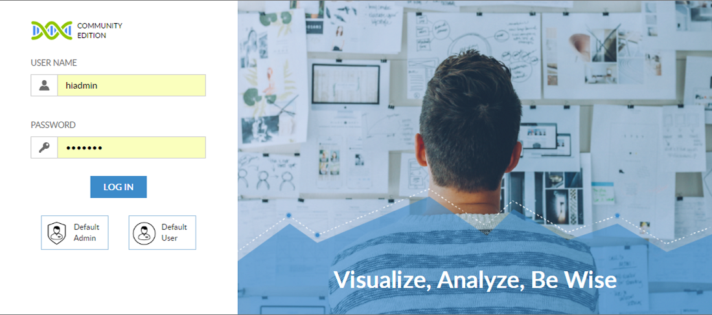
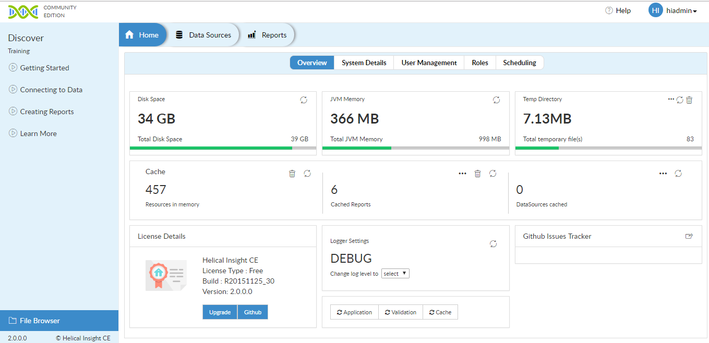
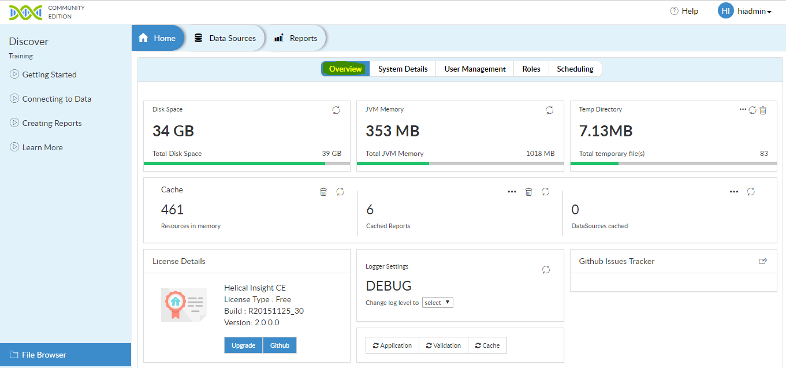
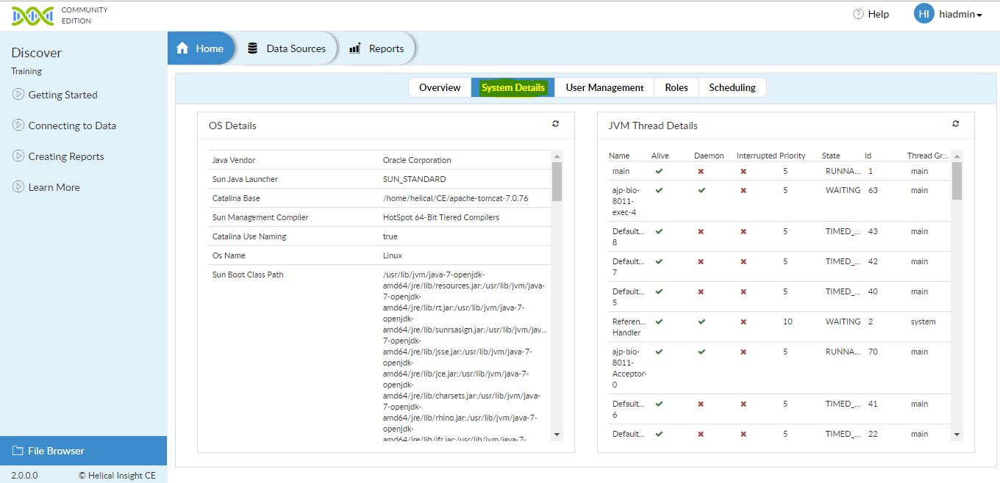
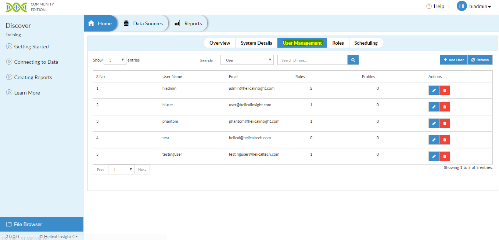
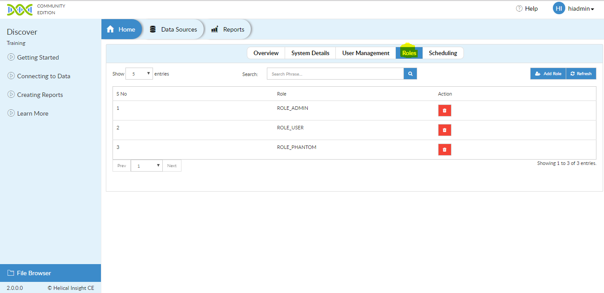
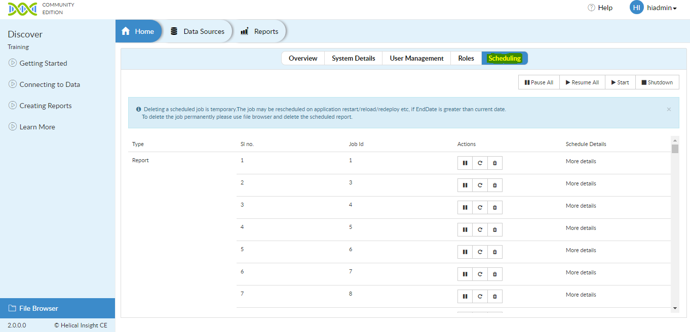
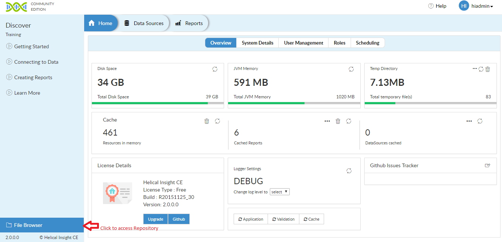
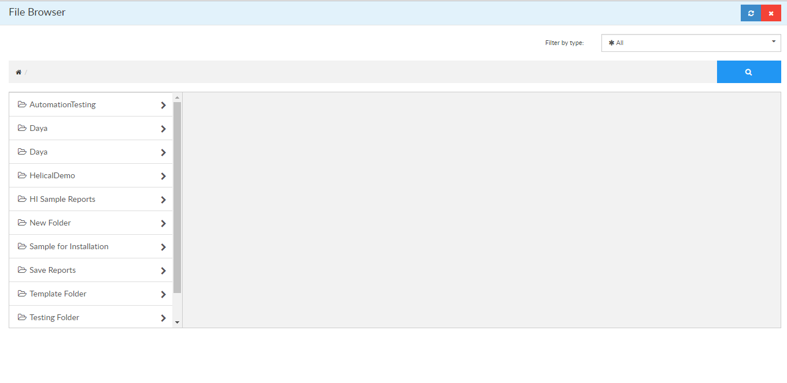
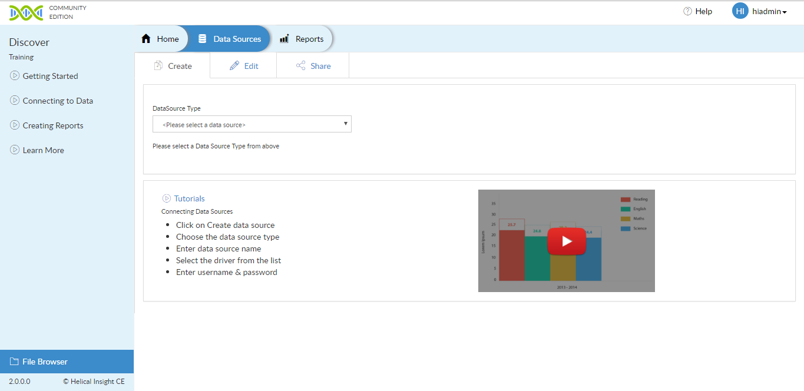

# UI Introduction

### Helical Insight Page(HI)

In this article, we will explain about the Helical Insight UI. User needs to access the Helical Insight through url :

After opening Helical Insight page, user needs to provide the required credentials or can access application through default credential and click on 'LOG IN' button, now user will be able to login and can see the `Home` page of Helical Insight. 

!> Note : If you  have logged in as admin, there would be more options visible.

### Admin Page

#### Overview

#### System Details

#### User Management

#### Roles

#### Scheduling

#### Repository

To access Helical Insight repository you need to click on `File Browser` present at left bottom corner of Helical Insight as shown below :

You can see file browser wherein you can perform various operations like 
* `Create` 
* `Open`
* `Delete`
* `Share`
* `Rename`
* `Open in new window`
* `Properties`
* `Search`

### Data Sources Page

In Data Source page you will learn about the usage of Datasource. To perform any operation on the database, user has to define a datasource.

Where , you can `Create` `Edit` `Share` Data Source.

