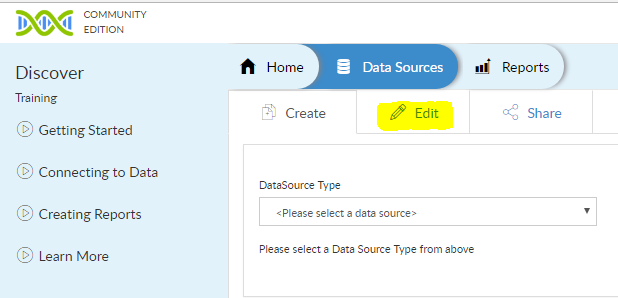
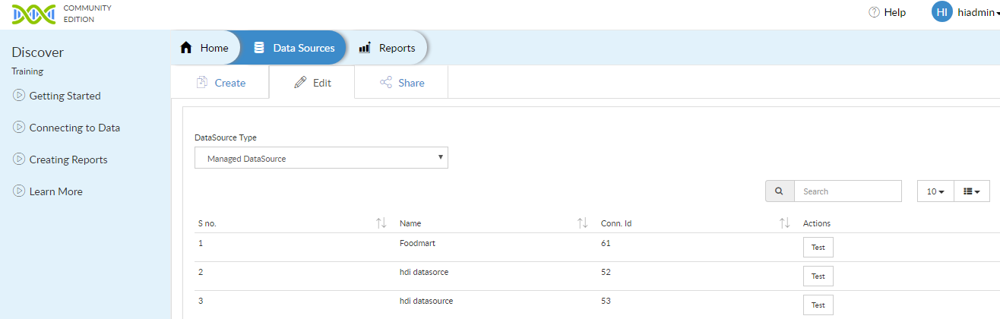
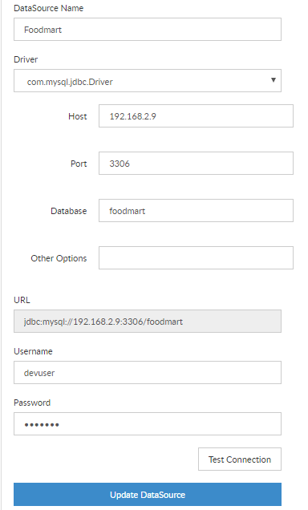

# View & Edit Data Sources

In this article, you will learn about how to view and edit existing datasources. 
Navigate to `Data Sources`, then click on `Edit`.

Then from the edit data source page, select the required datasource type. Here we are going to use `Managed DataSource`. On selecting managed datasource, list of all the Managed DataSources which have been saved appears with scrolldown option. 

You can click on `Test` to check the successfull database connectivity.

You can also click on the datasource name to see and edit the details. Any of the details like `DataSource Name`, `Host Name`, `Port Address`, `Database Name`, `username`, `password` can be updated. Changes can be saved in the data source via clicking on `Update DataSource`. Updated connection details can be accessed via Edit as explained earlier.

