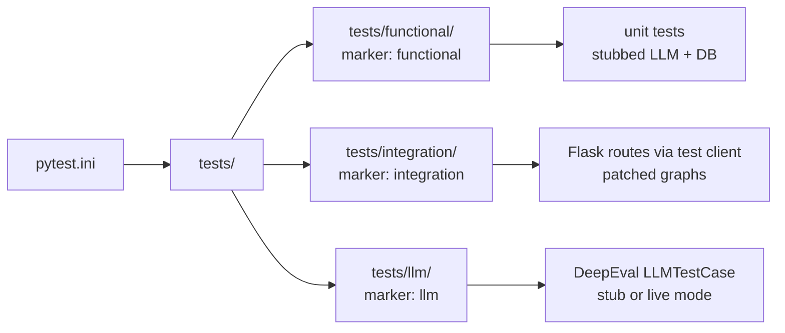

# Testing HelicalBI

This project uses [pytest](https://pytest.org/) with three marker-driven layers: **functional**, **integration**, and **llm** (DeepEval prompt tests). Configuration lives in [pytest.ini](pytest.ini).

## Prerequisites

1. Use a **virtual environment** (recommended).

   ```powershell
   python -m venv .venv
   .\.venv\Scripts\Activate.ps1
   ```

   On macOS or Linux:

   ```bash
   python3 -m venv .venv
   source .venv/bin/activate
   ```

2. Install the application dependencies:

   ```bash
   pip install -r requirements.txt
   ```

3. Install **test** dependencies (pytest, pytest-mock, pytest-cov, deepeval):

   ```bash
   pip install -r requirements-test.txt
   ```

Use a **recent Python 3** release compatible with the packages in `requirements.txt` (for example 3.10 or newer).

## Test layout

| Path | Role |
|------|------|
| [tests/functional/](tests/functional/) | Unit-style tests; marked `functional`. Heavy use of mocks and of stubs from [tests/conftest.py](tests/conftest.py). |
| [tests/integration/](tests/integration/) | Flask routes via the test client; marked `integration`. Graphs are patched so LangGraph and LLMs are not called. |
| [tests/llm/](tests/llm/) | DeepEval `LLMTestCase` tests over production prompt templates; marked `llm`. |

**Global stubs:** [tests/conftest.py](tests/conftest.py) installs lightweight stand-ins for `helicalbi.common.configuration` (no real LLM ping at import) and for Postgres checkpoint plumbing so tests run **without Ollama, OpenAI, or a live database** during normal collection and most runs.

## Running everything

From the repository root (where `pytest.ini` lives):

```bash
pytest
```

This picks up `addopts` from `pytest.ini` (for example `-v --tb=short --color=yes -p no:cacheprovider`).

## Running a single layer by marker

| Goal | Command |
|------|---------|
| Functional only | `pytest -m functional` |
| Integration only | `pytest -m integration` |
| LLM / DeepEval only | `pytest -m llm` |
| Everything except LLM | `pytest -m "not llm"` |

## Running a single file, class, or test

```bash
pytest tests/functional/test_chat_manager.py
```

```bash
pytest tests/functional/test_chat_manager.py::TestAddMessage::test_threads_are_isolated
```

```bash
pytest tests/llm/test_llm_prompts.py::TestDomainTopicPrompt -v
```

Keyword filter (matches test names):

```bash
pytest -k "canceled_meeting"
```

## DeepEval (LLM prompt) tests

Tests live in [tests/llm/test_llm_prompts.py](tests/llm/test_llm_prompts.py). They build `LLMTestCase` instances and score outputs with:

- **Offline metrics** (no judge LLM): JSON shape, expected values, hallucination checks against the cube schema, and SQL keyword checks.
- **`GEval` judge metrics** (optional): only when `HELICALBI_LLM_MODE=live`; they expect a judge model (typically OpenAI), so set `OPENAI_API_KEY` when using live mode with GEval.

### Modes: `stub` vs `live`

The `llm_mode` fixture in [tests/llm/conftest.py](tests/llm/conftest.py) reads:

| `HELICALBI_LLM_MODE` | Behavior |
|----------------------|----------|
| `stub` (default) | Deterministic canned outputs from [tests/llm/prompt_runner.py](tests/llm/prompt_runner.py). No network calls for the model. Custom metrics only; GEval is not added. |
| `live` | Real LLM via `LLMManager` in `prompt_runner._live_llm`. GEval metrics are appended when the judge is available. |

**PowerShell (Windows):**

```powershell
$env:HELICALBI_LLM_MODE = "live"
$env:OPENAI_API_KEY = "sk-..."   # for GEval judge when using live mode
pytest -m llm
```

**Bash:**

```bash
export HELICALBI_LLM_MODE=live
export OPENAI_API_KEY=sk-...   # for GEval judge when using live mode
pytest -m llm
```

### If `deepeval` is not installed

The LLM test module uses `pytest.importorskip("deepeval", ...)`; without the package those tests are skipped rather than failing the rest of the suite. Install `deepeval` via [requirements-test.txt](requirements-test.txt).

## Integration tests

Fixtures are defined in [tests/integration/conftest.py](tests/integration/conftest.py):

- **`app_module`** — Imports `app` once per session and reloads it so graph construction runs under the stubbed configuration from the top-level conftest.
- **`flask_client`** — Flask test client with `TESTING` enabled.
- **`patch_graphs`** — Replaces `main_graph` and `viz_graph` with mocks that return fixed payloads so routes can be exercised end-to-end without real LangGraph or LLM calls.

## Useful pytest flags

| Flag | Meaning |
|------|---------|
| `-v` | Verbose (one line per test). |
| `-x` | Stop after the first failure. |
| `-k EXPR` | Run tests whose names match the expression. |
| `--lf` | Re-run only tests that failed last time. |
| `-s` | Do not capture stdout/stderr (show prints). |

**Coverage:** `pytest-cov` is listed in [requirements-test.txt](requirements-test.txt). [`.coveragerc`](.coveragerc) measures the `helicalbi` package and the top-level `app` module, and omits `tests/`.

Terminal summary with missing lines:

```bash
pytest --cov=helicalbi --cov=app --cov-config=.coveragerc --cov-report=term-missing
```

HTML report: after a run, open [`htmlcov/index.html`](htmlcov/index.html) in a browser. Pytest also writes a data file [`.coverage`](.coverage) in the project root (listed in [`.gitignore`](.gitignore) so it is not committed).

Terminal plus HTML in one command:

```bash
pytest --cov=helicalbi --cov=app --cov-config=.coveragerc --cov-report=term-missing --cov-report=html
```

Same as above, but skip slower LLM prompt tests:

```bash
pytest -m "not llm" --cov=helicalbi --cov=app --cov-config=.coveragerc --cov-report=term-missing --cov-report=html
```

If **collection** fails for a few modules (for example import-time HTTP to the API base URL), you can still run the rest of the suite and emit coverage:

```bash
pytest --continue-on-collection-errors --cov=helicalbi --cov=app --cov-config=.coveragerc --cov-report=term-missing --cov-report=html
```

## Troubleshooting

| Symptom | Likely cause / fix |
|---------|---------------------|
| Import errors for `psycopg` or `langgraph.checkpoint.postgres` during tests | The suite stubs `PostgresFactory` in [tests/conftest.py](tests/conftest.py). Run tests from the repo root so pytest loads that conftest first. |
| Real LLM or Ollama contacted outside `-m llm` with `HELICALBI_LLM_MODE=live` | Only the LLM prompt runners bypass the stub when mode is `live`. For CI and local fast runs, omit `HELICALBI_LLM_MODE` or set it to `stub`. |
| GEval / judge errors about API key | Set `OPENAI_API_KEY`, or stay in `stub` mode where GEval is not used. |
| LLM tests skipped | Install test deps: `pip install -r requirements-test.txt`. |

## Reference diagram


