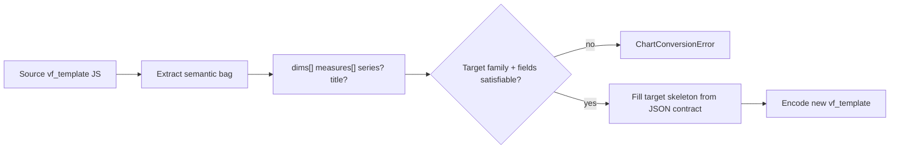

# Chart conversion (non-LLM)

InstantBI can switch Ant Design Charts visualization types without calling an LLM via `POST /convert-chart`.

Stack target: [`@ant-design/charts` ~1.4.x](https://ant-design-charts-v1.antgroup.com/en/examples) (G2Plot API). Templates assume `1.4.2`; `1.4.5` is API-compatible for these skeletons.

| Piece | Path |
|-------|------|
| Endpoint | [`bl/convert_chart.py`](../bl/convert_chart.py) |
| Utility | [`helicalbi/viz/chart_conversion.py`](../helicalbi/viz/chart_conversion.py) |
| Chart catalog | [`helicalbi/viz/charts/*.json`](../helicalbi/viz/charts/) |
| Loader | [`helicalbi/viz/_charts.py`](../helicalbi/viz/_charts.py) |

---

## Endpoint

`POST /convert-chart`

```json
{
  "input": {
    "vf_template": "<base64 UTF-8 JS/JSX>",
    "selected_chart": "bar",
    "chat_id": "...",
    "chat_sequence_id": 1
  }
}
```

Aliases accepted: none — use `vf_template`, `selected_chart`, `chat_id`, `chat_sequence_id`.

Server proxy: `POST /ai/convert-chart` (see [`InstantBIController-API.md`](../../../server/instant/docs/InstantBIController-API.md)).

Response:

```json
{
  "viz": {
    "vf_template": "<base64>",
    "chart_name": "bar",
    "vf_title": "...",
    "vf_reason": "...",
      "similar_chart": [{"vf.heatmap": "heatmap"}, {"vf.column": "column"}, {"vf.pie": "pie"}, "..."]
  }
}
```

`vf_template` uses the same wire encoding as `/interactive` (`base64(utf-8)` of the Draw* JS function).

---

## How conversion works

Charts are **not** universally interchangeable. Conversion does **not** use a source→target allowlist table.



### Runtime gates (what actually runs)

1. **Target must declare `conversion`** in its chart JSON.
2. **`_FAMILY_REQUIREMENTS`** — minimum dimensions / measures for the target `family` (e.g. `dual_axes` needs ≥2 measures, `heatmap` needs ≥2 dimensions).
3. **Required placeholders** in `conversion.fields` must be fillable from the bag.
4. **Source `family`** is used only to *extract* field roles correctly (e.g. bar swaps axes; pie uses `angleField` / `colorField`) — not to decide whether A→B is allowed.

So `bar → pie` works because both can be satisfied by a 1-dimension + 1-measure bag, not because a map lists them as interchangeable.

### Design guidance (safe swap groups)

Useful when authoring JSON / reasoning about UX; **not** an allowlist in code:

| Safe swap group | Examples | What changes |
|-----------------|----------|--------------|
| Cartesian 1D+1M | column, line, area, point, tiny_*, funnel, waterfall, radar, rose, scatter | same `xField` / `yField` |
| Horizontal bar | bar | axis swap measure ↔ dimension |
| Part-to-whole | pie, arc, donut, doughnut | `angleField` / `colorField` |
| DualAxes | column_line, dual_line, stacked_* | geometry; needs **2 measures** |
| Shallow hierarchy | treemap, circle_packing, relation | same nest builder |
| Percent pair | gauge ↔ progress | scalar reduce |

**Not** remappable by field fill alone without extra data: KPI/table/grid (different UI), heatmap (2 dims), bubble (2+ measures), sunburst (2-level nest), calendar reshape, DualAxes from a single-measure chart.

---

## Per-chart JSON: `conversion` contract

Each file under `helicalbi/viz/charts/<viz_type>.json` may include:

```json
{
  "conversion": {
    "family": "cartesian",
    "component": "Column",
    "fields": {
      "dimension_column": { "role": "dimension", "index": 0 },
      "measure_column": { "role": "measure", "index": 0 },
      "series_field": { "role": "series", "optional": true }
    },
    "omit_when_missing": ["series_field", "legend"]
  }
}
```

| Key | Meaning |
|-----|---------|
| `family` | Data-shape family (see below) |
| `component` | Ant Design Charts / InstantBI component name (documentation + future use) |
| `fields` | Skeleton placeholder → semantic bag role (`dimension` \| `measure` \| `series` \| `title`) and `index` |
| `optional` | If true, placeholder may be omitted when the bag has no value |
| `omit_when_missing` | Config keys / placeholders to strip when unbound (avoids fake `seriesField`) |

### Families

`cartesian` | `bar` | `pie` | `dual_axes` | `tiny` | `hierarchy` | `percent` | `heatmap` | `bubble` | `kpi` | `table` | `other`

### Family → charts (catalog)

| Family | Charts |
|--------|--------|
| cartesian | column, line, area, point, scatter, waterfall, funnel_chart, radar, rose_chart |
| bar | bar |
| pie | pie, arc, donut, doughnut |
| tiny | tiny_line, tiny_column, tiny_area |
| dual_axes | column_line, dual_line, grouped_column_line, stacked_column_line, stacked_and_grouped_column_line |
| bubble | bubble_chart |
| heatmap | heatmap, calendar |
| hierarchy | treemap, circle_packing, relation, sunburst |
| percent | gauge, progress |
| kpi | kpi |
| table | table, grid_table |
| other | wordcloud, other |

### Minimum bag sizes (`_FAMILY_REQUIREMENTS`)

| Family | Min dimensions | Min measures |
|--------|----------------|--------------|
| cartesian, bar, pie, tiny, hierarchy | 1 | 1 |
| dual_axes | 1 | 2 |
| heatmap | 2 | 1 |
| bubble | 0 | 2 |
| percent, kpi | 0 | 1 |
| table, other | 0 | 0 (per-field flags enforce specifics) |

Special cases:

- **bar**: skeleton `xField` = measure, `yField` = dimension
- **pie family**: `angleField` / `colorField`
- **dual_axes**: `yField: [m1, m2]`
- **sunburst**: requires second dimension via `secondary_dimension_column` (index 1)

### What does *not* belong in JSON

- Source-chart if/else trees
- LLM polish prose (use `instructions`)
- Full data reshape scripts (hierarchy nest, calendar) — keep as Python helpers keyed by family only when needed

---

## Adding a new convertible chart

1. Add `helicalbi/viz/charts/<name>.json` with `code` skeleton (placeholders like `dimension_column`, `measure_column`).
2. Add a `conversion` block with the correct `family` and field roles.
3. No Python module required unless the family needs a new reshape helper or `_FAMILY_REQUIREMENTS` entry.

---

## Related

- LLM viz fill still uses the same skeletons via `get_chart_config()` / ChartFiller.
- `similar_chart` on the response comes from `resolve_similar_charts` (selection filter), not from conversion families.
