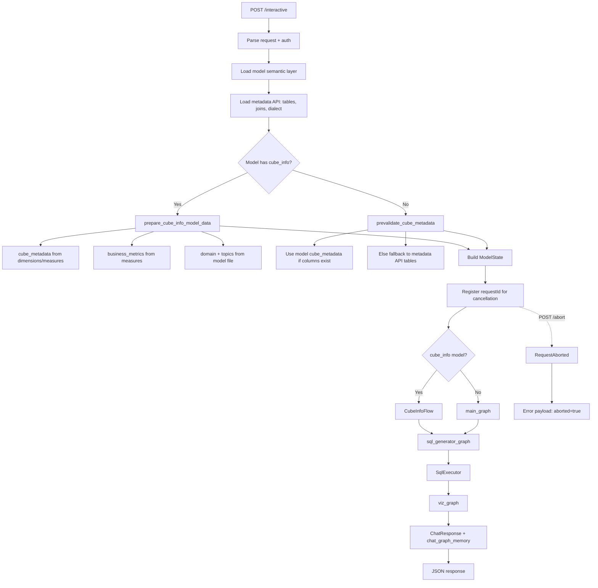
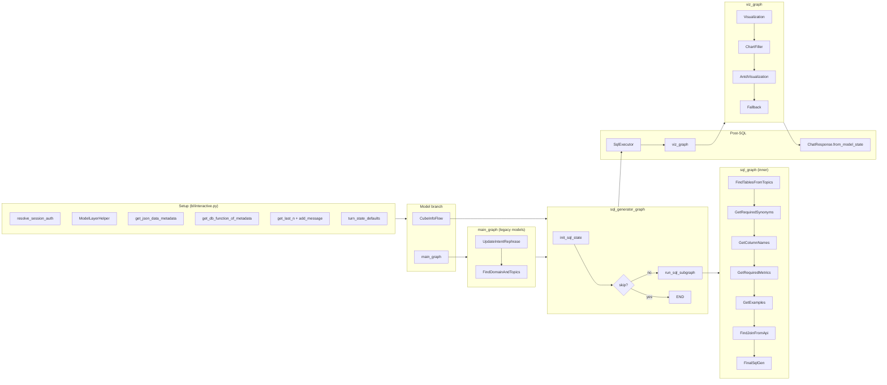
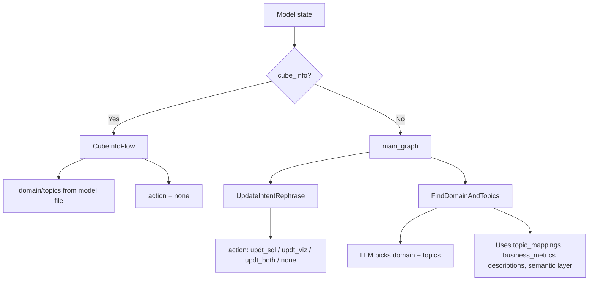

# Interactive Flow (`POST /interactive`)

This document describes the end-to-end flow for the **interactive** chat endpoint implemented in [`bl/interactive.py`](../bl/interactive.py). It covers request handling, model-file branching, LangGraph orchestration, SQL execution, visualization, response shaping, and all supported use cases.

---

## Overview

The `/interactive` endpoint turns a natural-language question into:

1. Resolved **domain** and **topics** (or reads them from the model file)
2. Generated **SQL**
3. Executed **data** and **metadata**
4. A natural-language **insight** summary
5. A **visualization** configuration

The route is the main “ask a question, get SQL + chart + answer” entry point for the HelicalBI model layer.

---

## High-level flow diagram



---

## Detailed orchestration diagram



---

## Step-by-step explanation

### 1. Request intake

| Input field | Purpose |
|-------------|---------|
| `input.inputString` | User question |
| `input.model.file` / `input.model.dir` | Model semantic layer location |
| `input.chatid` | Chat thread id |
| `input.chat_seq_id` | Turn id within the thread |
| `input.last_chats` | Optional chat history fallback |
| `requestId` | Optional cancellation key (query param or JSON) |
| Session auth | `sessionCookie` + `username` |

The handler resolves authentication, loads the model file, and fetches the linked metadata definition (tables, joins, database name, dialect).

### 2. Model file detection and schema preparation

Two model shapes are supported.

#### A. Legacy model (`cube_metadata`)

Used when the model file has `cube_metadata` (and typically `topic_mappings`, `business_metrics`, `synonyms`, `examples`).

- `prevalidate_cube_metadata()` keeps model `cube_metadata` when it already lists columns.
- If the model only lists tables without columns, schema is **backfilled from the metadata API**.

#### B. Cube-info model (`cube_info`)

Used when `is_cube_info_model()` finds a non-empty `cube_info` array with dimensions and/or measures.

`prepare_cube_info_model_data()` produces:

| Output | Source |
|--------|--------|
| `cube_metadata` | Converted from `cube_info` dimensions/measures; `tableId`/`columnId` resolved via metadata API |
| `domain` / `topics` | Read directly from the model `domain` block |
| `business_metrics` | Derived from measures (`measureName`, `metric`, `formula`, `filter`, `aggregator`) merged with any top-level `business_metrics` |

This path **skips LLM domain/topic discovery**.

### 3. Model state initialization

`turn_state_defaults()` resets ephemeral per-turn fields (`sql`, `sql_result`, `visualization`, token usage, etc.).

The state also carries:

- `cube_metadata`, `relationship_of_table` (joins), `dialect`, `dbname`
- `business_metrics` (cube_info path only, on state; legacy path loads from model inside `SqlGenerator`)
- `last_chats` from `ChatManager.get_last_n(thread_id)` or request payload

### 4. Domain / intent branch



**UpdateIntentRephrase** classifies follow-up intent:

| `action` | Meaning |
|----------|---------|
| `none` | New question |
| `updt_sql` | Change data slice / filters / metrics |
| `updt_viz` | Change chart only |
| `updt_both` | Change SQL and visualization |

**FindDomainAndTopics** uses `InformationProvider` to build LLM context from domain definitions, topic mappings, semantic layer, and matching business-metric descriptions.

### 5. SQL generator graph

`sql_generator_graph` wraps the inner `sql_graph`:

1. `init_sql_state` — sets `sql = "Not generated"`
2. If `state.skip` is true → skip SQL generation
3. Else `run_sql_subgraph` → invokes `sql_graph` and folds results back into `ModelState`

Inner SQL pipeline:

| Step | Responsibility |
|------|----------------|
| **FindTablesFromTopics** | Resolve `required_tables` from topics + topic_mappings; fallback to all cube tables |
| **GetRequiredSynonyms** | Pick synonym hints relevant to the query |
| **GetColumnNames** | LLM builds `query_plan` (`columnName[]`, `reason`) |
| **GetRequiredMetrics** | Filter `business_metrics` to those matching required tables/columns |
| **GetExamples** | Attach few-shot SQL examples |
| **FindJoinFromApi** | Resolve join paths from metadata API |
| **FinalSqlGen** | LLM generates final SQL using query plan, joins, and required business metrics |

#### Business metrics matching

`GetRequiredMetrics` uses `BusinessMetricMatcher`. A metric is included when **any** of these reference the required schema (`required_tables` + `query_plan.columnName`):

- `tables`
- `column_name`
- `formula`
- `filter`
- Any nested key or value in the metric object

### 6. SQL execution (`SqlExecutor`)

Unless `skip` is set:

1. Calls `execute_query` against the metadata-backed query API
2. On **success**: stores `data`, `metadata`, generates a success insight via LLM
3. On **failure**: stores `sql_error`, generates an error insight, sets `skip = True` (visualization may be degraded)

### 7. Visualization graph

`viz_graph` runs sequentially:

1. **Visualization** — choose chart type and intent
2. **ChartFiller** — fill chart config from data
3. **AntdVisualization** — build Ant Design chart template
4. **Fallback** — safe defaults if earlier steps fail

### 8. Response assembly

- SQL is pretty-printed and wrapped in a ` ```sql ` fence for the client
- `ChatResponse.from_model_state()` builds `chat_response` with `viz`, `sql`, `summary`, `data`, `metadata`, `token_usage`
- `chat_graph_memory.add_node()` persists the turn for later load/insight flows

---

## Request and response shapes

### Minimal request

```json
{
  "input": {
    "sessionCookie": "...",
    "username": "user1",
    "inputString": "Show total travel cost by destination",
    "chatid": "thread-001",
    "chat_seq_id": 1,
    "model": {
      "file": "travel-model.json",
      "dir": "/models"
    }
  }
}
```

### Success response (simplified)

```json
{
  "chat_response": {
    "viz": {
      "vf_template": "...",
      "chart_name": "bar",
      "vf_title": "Travel cost by destination",
      "vf_reason": "..."
    },
    "sql": {
      "raw_sql": "SELECT ...",
      "dialect": "db2",
      "required_domain": ["Sales Operation"],
      "required_topic": ["Travel"],
      "required_table": ["travel_details"],
      "required_column": ["travel_details.travel_cost"],
      "required_join": "...",
      "reason": "..."
    },
    "summary": {
      "insight": "Natural language answer...",
      "reason": ""
    },
    "data": [{ "...": "..." }],
    "metadata": [{ "...": "..." }],
    "token_usage": { "input_tokens": 0, "output_tokens": 0, "total_tokens": 0 }
  }
}
```

### Error / abort response

| Case | Payload |
|------|---------|
| User cancelled (`POST /abort`) | `{ "error": "Request has been cancelled.", "aborted": true, "chat_response": {} }` |
| Unhandled exception | `{ "error": "<message>", "stack": "..." (debug only), "chat_response": {} }` |

---

## Model file use cases

### UC-1: Full legacy semantic model

**When:** Model has `cube_metadata`, `topic_mappings`, `domain`, `business_metrics`, `synonyms`, `examples`.

**Flow:** `main_graph` → full SQL pipeline → execute → visualize.

**Example question:** “How many canceled meetings did we have last quarter?”

**Behavior:**

- LLM selects domain/topics
- Tables resolved via topic → component → cube mapping
- Business metrics like `canceled_meetings` matched by table and filter/formula
- Joins fetched from metadata API

---

### UC-2: Bare-minimum legacy model

**When:** Model has `cube_metadata` but **no** `topic_mappings`.

**Flow:** Same as UC-1, but `InformationProvider` and `GetContextForSQL` use **bare-minimum schema context** (all tables/columns listed for the LLM).

**Example question:** “List all columns from employee_details.”

**Behavior:**

- No topic-to-table mapping; all cube tables are candidates
- Business metric descriptions fall back to cube descriptions if metrics do not match

---

### UC-3: Legacy model with empty cube columns (metadata API fallback)

**When:** Model `cube_metadata` lists `database_table` but no `column_name` entries.

**Flow:** `prevalidate_cube_metadata()` replaces schema with metadata API tables/columns before graphs run.

**Example question:** “Count rows in orders.”

**Behavior:** Column discovery uses live metadata, not the sparse model file.

---

### UC-4: Cube-info model

**When:** Model has `cube_info` with `dimensions` and `measures` (see structure below).

**Flow:** `CubeInfoFlow` → SQL pipeline → execute → visualize. **No** `FindDomainAndTopics` LLM call.

```json
{
  "domain": [
    {
      "domain_name": "Sales Operation",
      "description": "...",
      "topics": ["Travel", "Meetings"]
    }
  ],
  "cube_info": [
    {
      "cubeName": "Travel Cube",
      "dimensions": [
        {
          "dimensionName": "Booking Platform",
          "tableId": "112",
          "columnName": "booking_platform",
          "columnId": "1074"
        }
      ],
      "measures": [
        {
          "measureName": "Destination Count",
          "aggregator": "count",
          "tableId": "112",
          "columnName": "destination_id",
          "metric": {
            "metric": "destination_count",
            "description": "Count of destinations"
          }
        }
      ]
    }
  ]
}
```

**Example question:** “Show destination count by booking platform.”

**Behavior:**

- `tableId`/`columnId` resolved to physical names via metadata API
- Measures become `business_metrics` for `FinalSqlGen`
- Domain/topics taken from model file as-is

---

### UC-5: Cube-info model with formula/filter metrics

**When:** Measure or top-level `business_metrics` include `formula` and/or `filter` referencing tables/columns not listed in `tables`.

**Example metric:**

```json
{
  "metric": "travel_cost_total",
  "formula": "SUM(travel_details.travel_cost)",
  "filter": "travel_details.status = 'Approved'"
}
```

**Behavior:** `GetRequiredMetrics` still selects this metric when `query_plan` or `required_tables` reference `travel_details` / `travel_cost`.

---

### UC-6: Follow-up — update SQL only (`updt_sql`)

**When:** User asks to change filters, metrics, or row-level data in a continuing chat.

**Example:** “Same chart but only for 2024.”

**Behavior:**

- `UpdateIntentRephrase` sets `action = updt_sql`
- `last_chats` and previous SQL inform `FinalSqlGen`
- Visualization may or may not change

---

### UC-7: Follow-up — update visualization only (`updt_viz`)

**When:** User asks to change chart type or formatting without changing the data request.

**Example:** “Show the same data as a pie chart.”

**Behavior:**

- `UpdateIntentRephrase` sets `action = updt_viz`
- `FinalSqlGen` may reuse previous SQL when appropriate
- `viz_graph` drives the primary change

---

### UC-8: New question in an existing thread (`action = none`)

**When:** User asks an unrelated question in the same `chatid`.

**Behavior:** Intent rephrase keeps the raw query; domain/topics rediscovered (legacy) or re-read from model (cube_info).

---

### UC-9: SQL execution success

**When:** Generated SQL runs successfully against the metadata query API.

**Outcome:**

- `data` and `metadata` populated
- LLM success insight in `summary.insight`
- Visualization built from result set

---

### UC-10: SQL execution failure

**When:** Query API returns `status != 1`.

**Outcome:**

- `sql_error` set
- Error insight returned to user
- `skip = True` set on state (downstream viz may be limited)
- `chat_response` still returned with error context in summary

---

### UC-11: Request cancellation

**When:** Client sends `POST /abort` with the same `requestId` while `/interactive` is in flight.

**Behavior:**

- `ensure_not_aborted()` raises `RequestAborted`
- Response: `aborted: true`, empty `chat_response`
- Cancellation registry cleared in `finally`

---

### UC-12: Chat history sources

**When:** Thread has prior turns.

| Source | Priority |
|--------|----------|
| `ChatManager.get_last_n(thread_id)` | Primary |
| `input.last_chats` from request | Fallback if server history empty |

Used by intent rephrase, column detection, and SQL generation prompts.

---

### UC-13: Skip SQL generation

**When:** `state.skip` is true before `sql_generator_graph` (set by an upstream error or control flag).

**Behavior:** SQL subgraph is not invoked; executor and viz may also short-circuit depending on state.

---

## Key source files

| Area | File |
|------|------|
| HTTP route | [`bl/interactive.py`](../bl/interactive.py) |
| Cancellation | [`bl/abort.py`](../bl/abort.py) |
| Cube-info detection/conversion | [`helicalbi/common/CubeInfoModel.py`](../helicalbi/common/CubeInfoModel.py) |
| Cube-info flow | [`helicalbi/core/flows/CubeInfoFlow.py`](../helicalbi/core/flows/CubeInfoFlow.py) |
| Legacy main graph | [`helicalbi/core/flows/MainFlowGraph.py`](../helicalbi/core/flows/MainFlowGraph.py) |
| SQL wrapper graph | [`helicalbi/core/flows/SqlGenerator.py`](../helicalbi/core/flows/SqlGenerator.py) |
| SQL inner graph | [`helicalbi/core/sqlflow/SqlFlowGraph.py`](../helicalbi/core/sqlflow/SqlFlowGraph.py) |
| Business metric matching | [`helicalbi/core/sqlflow/util/BusinessMetricMatcher.py`](../helicalbi/core/sqlflow/util/BusinessMetricMatcher.py) |
| SQL execution | [`helicalbi/core/flows/SqlExecutor.py`](../helicalbi/core/flows/SqlExecutor.py) |
| Visualization | [`helicalbi/core/vizflow/VizFlowGraph.py`](../helicalbi/core/vizflow/VizFlowGraph.py) |
| Response model | [`helicalbi/model/output/ChatResponse.py`](../helicalbi/model/output/ChatResponse.py) |
| Graph wiring | [`GraphBuilderManger.py`](../GraphBuilderManger.py) |

---

## Related endpoints

| Endpoint | Relationship |
|----------|--------------|
| `POST /abort` | Cancels in-flight `/interactive` by `requestId` |
| `POST /loadChat` | Loads persisted chat graph memory |
| `POST /suggestDomain` | Returns suggested domain from model file |
| `POST /topNQuestion` | KPI suggestions using business metrics context |
| `POST /getSemanticData` | Builds blank semantic layer from metadata (model authoring) |

---

## Testing

Integration tests for the route live in [`tests/integration/test_app_routes.py`](../tests/integration/test_app_routes.py) (`TestInteractive`).

Functional tests for cube-info and business-metric matching:

- [`tests/functional/test_cube_info_model.py`](../tests/functional/test_cube_info_model.py)
- [`tests/functional/test_business_metric_matcher.py`](../tests/functional/test_business_metric_matcher.py)

See also [`TESTING.md`](../TESTING.md) for how to run the test suite.
