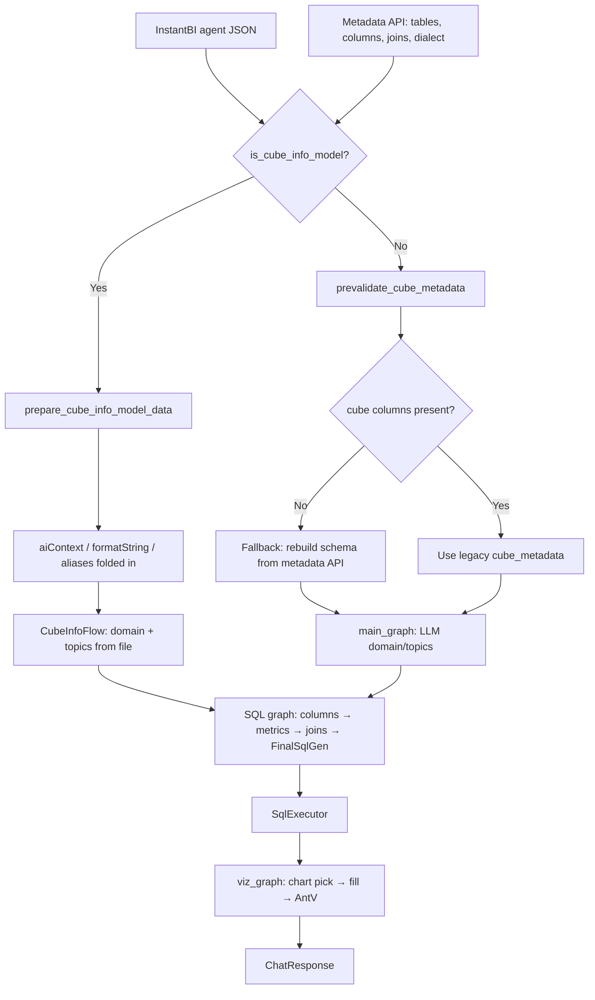

# Model Consumption Guide

How HelicalBI reads a semantic model (`cube_info`), resolves it against InstantBI metadata, builds SQL, and drives visualization. Intended for **model authors** and **testers**.

For the full `/interactive` orchestration, see [INTERACTIVE_FLOW.md](INTERACTIVE_FLOW.md).

---

## Why this matters

Models are **not** checked into this repo. They live in InstantBI agent JSON and are fetched at runtime. This service:

1. Detects modern `cube_info` vs legacy `cube_metadata`
2. Resolves physical tables/columns via the **metadata API**
3. Converts the model into internal schema + business metrics
4. Generates SQL, executes it, then fills a chart from `viz/charts/*.json`

If dimensions, measures, aliases, `aiContext`, or `formatString` are wrong or incomplete, SQL and charts degrade in predictable ways (documented below).

---

## End-to-end flow



**Key code**

| Area | Path |
|------|------|
| Detect / convert / prepare | `helicalbi/common/CubeInfoModel.py` |
| Legacy + metadata fallback | `helicalbi/common/JsonToPara.py` |
| Interactive wiring | `bl/interactive.py` |
| Chart catalogs | `helicalbi/viz/charts/*.json` |
| Living fixtures | `tests/functional/test_cube_info_model.py` |

---

## Model shapes

### A. Preferred: `cube_info`

Detected when `cube_info` (or `cube`) is a non-empty list and dimensions/measures (or hierarchy levels) expose `columnName` / `dimensionName` / `measureName`.

```json
{
  "domain": [
    {
      "domain_name": "Sales Operation",
      "description": "Travel domain metadata",
      "topics": ["Travel", "Meetings"]
    }
  ],
  "cube_info": [
    {
      "cubeName": "Travel Cube",
      "dimensions": [
        {
          "dimensionName": "Booking Platform",
          "semanticType": "string",
          "synonyms": ["platform"],
          "tableId": "112",
          "columnName": "booking_platform",
          "columnId": "1074",
          "description": "Booking platform name",
          "formatString": "#,##0",
          "sortOrder": 0,
          "aiContext": {
            "instructions": "group platforms; do not invent new platform names",
            "synonyms": "channel, booking source",
            "examples": "bookings by platform"
          }
        }
      ],
      "measures": [
        {
          "measureName": "Destination Count",
          "aggregator": "count",
          "tableId": "112",
          "columnId": "1070",
          "columnName": "destination_id",
          "semanticType": "numeric",
          "formatString": "0.00",
          "description": "Number of destinations",
          "metric": {
            "metric": "destination_count",
            "description": "Count of destinations",
            "aggregator": "count"
          },
          "aiContext": {
            "instructions": "always count distinct destinations when user says unique",
            "synonyms": "destinations, destination total",
            "examples": "how many destinations by platform"
          }
        }
      ]
    }
  ]
}
```

**What the pipeline produces** (`prepare_cube_info_model_data`):

| Output | Role |
|--------|------|
| `cube_metadata` | Internal table/column/measure schema for SQL prompts |
| `business_metrics` | Measures (+ formula/filter dims) for `FinalSqlGen` |
| `domain` / `topics` | Taken from the model file (no LLM discovery) |
| `topic_mappings` | Derived from topic components or all dim/measure names |
| `format_strings` / `column_format_strings` | Excel-style formats for viz |
| `ai_instructions` / `column_ai_instructions` | Prompt text for SQL + viz |

### B. Legacy: `cube_metadata`

Table-centric list with `database_table`, `columns[]`, optional `measures[]`, plus top-level `topic_mappings`, `business_metrics`, `synonyms`. Domain/topics are discovered by LLM via `main_graph`.

---

## Dimensions and measures

### Dimensions → SQL columns

| Field | Required? | Consumed as |
|-------|-----------|-------------|
| `dimensionName` | Strongly preferred | Display alias (`alias_name`); used in `pickedDimensions` |
| `semanticType` | Optional | Hint in schema text (`string`, `Text`, …) |
| `description` / `synonyms` | Optional | SQL/synonym prompts |
| `formatString` | Optional | Viz number/text formatting |
| `sortOrder` / `sort` | Optional | `0`/`asc` → ASC, `1`/`desc` → DESC |
| `metric.formula` / `filter` | Optional | Promotes the dim into `business_metrics` |
| `aiContext` | Optional | Folded into description + dedicated AI fields |
| `hierarchies` | Optional | Flattened to levels before conversion |

### Measures → SQL metrics

| Field | Required? | Consumed as |
|-------|-----------|-------------|
| `measureName` | Strongly preferred | Alias / computed column heading |
| Physical column **or** `metric.formula` | Required | Formula-only measures become `is_computed: true` |
| `aggregator` or `metric.aggregator` | Optional | e.g. `count`, `Sum` |
| `formatString` | Optional | Passed to chart fill (`formatFields`) |
| `aiContext` | Optional | Same folding as dimensions |

**Formula-only measure** (no physical `columnName`):

```json
{
  "measureName": "Travel Cost",
  "formatString": "0.00",
  "metric": { "formula": "SUM(travel_details.travel_cost)" }
}
```

SQL must expand the formula and alias the result with `measureName`. Table can be inferred from `table.column` tokens 

### Hierarchies

Levels under `dimensions[].hierarchies[].levels` (or measures) are **flattened** first. Levels win when names collide with the parent. Parent `formatString` / `sortOrder` inherit onto levels when omitted. Each level’s `aiContext` is applied independently.

---

## `aiContext` (AI guidance)

Accepted as `aiContext` or `ai_context` on any dimension, measure, or hierarchy level.

```json
"aiContext": {
  "instructions": "use sum",
  "synonyms": "total, amount",
  "examples": "sum of travel cost by platform"
}
```

| Key | Effect |
|-----|--------|
| `instructions` | → `ai_instructions`; appended to description as `AI instructions (SQL/viz): …`; injected into SQL and viz prompts |
| `synonyms` | List or comma/newline string → synonym resolution (`GetRequiredSynonyms`) |
| `examples` | → `ai_examples`; folded into description |

**Where it shows up**

- SQL context: `GetContextForSQL` column detail
- Viz prompts: `VizFillPrompt` / `AntdVizPrompt` via `{column_ai_instructions}`

**Author tip:** Put behavior that must affect SQL *and* charts in `instructions`. Put alternate user phrasings in `synonyms`. Put few-shot phrasing in `examples`.

---

## Aliases (three layers)

### 1. Semantic aliases (`cube_info`)

- Dimension → `alias_name = dimensionName`
- Measure → `alias_name = measureName`

These names appear in SQL result columns (when the LLM follows the schema) and in chart field `label` / `autogen_alias` / `alias`.

### 2. Metadata API aliases (fallback)

From InstantBI metadata:

```text
tables[table].alias
tables[table].columns[col].alias
```

Used when `dimensionName` / `measureName` is missing:

```text
preferred: dimensionName / measureName
else:      metadata column alias
```

Also used for table labels in prompts (`table_alias`).

### 3. Chart aliases (`viz/charts/*.json`)

User-facing chart names map to the file stem (`visualization_type`):

```json
"aliases": ["pivot", "pivot table", "crosstab table", "PivotView"]
```

→ chart key `grid_table`. Selection rules map aliases to the key; responses must return the key, never the alias.

---

## Fallback metadata

When the model is incomplete, the service recovers from the metadata API instead of failing immediately.

| Situation | Behavior | Code |
|-----------|----------|------|
| Legacy `cube_metadata` has tables but **no column names** | Rebuild schema from metadata API tables/columns | `prevalidate_cube_metadata()` in `JsonToPara.py` |
| Dim/measure missing `dimensionName` / `measureName` | Use metadata column `alias` | `cube_info_to_cube_metadata` |
| Resolve physical table | `columnName` as `table.col` → column map → | `_resolve_table_name` |
| Formula-only measure, | Infer table from formula tokens | `_table_from_formula` |
| No `topic_mappings` (bare-minimum) | Broader full-schema SQL context | bare-minimum path |
| Chart type `"other"` / alias `"fallback"` | Generic viz fallback | `viz/charts/other.json`, `Fallback.py` |

**Tester check:** For UC-3-style sparse models, confirm columns still appear in SQL context after fallback. See [INTERACTIVE_FLOW.md](INTERACTIVE_FLOW.md) UC-3.

**Joins are not on the cube model.** They always come from the metadata API (`joins[]`) and feed `FindJoinFromApi` → `FinalSqlGen`.

---

## How visualization consumes the model

Visualization does **not** read the raw agent JSON. It consumes:

1. **SQL result** columns (names should match dim/measure aliases)
2. **State** prepared from the model: `column_format_strings`, `column_ai_instructions`
3. **Chart template** from `helicalbi/viz/charts/<type>.json`

### Chart selection

`viz/_chart_selection.py` filters charts by **result** dimension/measure counts (and optional ordered/time-series):

| Chart file | Typical shape |
|------------|---------------|
| `bar.json` | 1 dim, 1 measure |
| `grid_table.json` | ≥1 dim, ≥1 measure (pivot / GridTable) |
| `kpi.json` | measures-focused |
| `other.json` | catch-all / fallback |

Each chart JSON defines:

| Key | Role |
|-----|------|
| `dims_min` / `dims_max` | Eligibility |
| `measures_min` / `measures_max` | Eligibility |
| `aliases` | User synonyms → chart key |
| `instruction` | Short picker description |
| `instructions` + `code` | LLM fill template |

### Model fields → chart fields

```text
dimensionName / measureName  →  SQL alias  →  chart field label / autogen_alias / alias
formatString                 →  properties.format.formatFields[].values.customFormat
aiContext.instructions       →  column_ai_instructions in VizFill / Antd prompts
```

**Pivot / GridTable example** (`grid_table.json`):

- Ant Design `Table` customized as a growable grid (antd has no native pivot)
- Dimensions then measures → column order
- Excel formats via `column.render` / `measure_formats`
- Pagination on; no fixed `scroll.y` so height grows with rows

### Prompt injection (viz)

`VizFillPrompt` / `AntdVizPrompt` include placeholders:

```text
{column_format_strings}
{column_ai_instructions}
```

Only the **cube_info** path reliably populates these. Legacy models without formats/aiContext will not get the same viz guidance.

---

## Author checklist (model developers)

Use this when adding or changing a cube:

1. **Link every field** — Prefer `columnName` so resolution is unambiguous.
2. **Name for humans** — Set `dimensionName` / `measureName`; these become SQL aliases and chart labels.
3. **Aggregators** — Put `aggregator` on the measure (or inside `metric`) for counts/sums.
4. **Formulas** — For computed measures, set `measureName` + `metric.formula`; leave `columnName` empty only when intentional.
5. **aiContext** — Add `instructions` for SQL/viz rules; `synonyms` for user language; `examples` for phrasing.
6. **formatString** — Excel-style (`0.00`, `#,##0`) so charts format measures correctly.
7. **Domain / topics** — Keep `domain[].topics` accurate; with `cube_info`, the LLM does not rediscover them.
8. **Topic components** — Prefer topic objects with `components[{id,name}]` when you want tight topic→field mapping.
9. **Do not put joins on the cube** — Maintain joins in InstantBI metadata.
10. **Hierarchies** — Know that levels are flattened and override parent names on collision.

---

## Tester checklist

| Scenario | What to verify |
|----------|----------------|
| Happy path cube_info | Question using dim + measure names → SQL uses physical columns, aliases match names |
| Synonym / aiContext | Query uses synonym from `aiContext.synonyms` → same columns picked |
| Formula measure | SQL expands formula; result column named like `measureName` |
| formatString | Viz `formatFields` / formatted display matches model |
| Missing dimensionName | Alias falls back to metadata column alias |
| Empty legacy columns | `prevalidate_cube_metadata` rebuilds from metadata API |
| Chart alias | “show as pivot” → `visualization_type: grid_table` |
| Dim/measure counts | 2+ dims + measure → grid_table eligible; 1+1 → bar/line/etc. |
| Hierarchy | Levels appear as selectable dims; parent-only empty fields do not block children |

**Automated coverage:** `tests/functional/test_cube_info_model.py`, `test_cube_info_picker.py`, `test_cube_info_sql_generator.py`, and [TESTING.md](../TESTING.md).

---

## Conversion snapshot (for debugging)

Given the Travel Cube example above and metadata:

```json
{
  "tables": {
    "travel_details": {
      "id": "112",
      "alias": "travel",
      "columns": {
        "booking_platform": { "id": "1074", "alias": "platform" },
        "destination_id": { "id": "1070", "alias": "destination_count" }
      }
    }
  }
}
```

Internal `cube_metadata` looks like:

```text
database_table: travel_details
table_alias:    travel
columns[]:  column_name=booking_platform, alias_name="Booking Platform"
measures[]: column_name=destination_id,  alias_name="Destination Count", aggregator=count, format_string=0.00
```

`business_metrics` includes an entry for **Destination Count** with tables, aliases, aggregator, and format. That is what `GetRequiredMetrics` and `FinalSqlGen` consume.

---

## Related docs

| Document | Contents |
|----------|----------|
| [INTERACTIVE_FLOW.md](INTERACTIVE_FLOW.md) | Full `/interactive` flow and use cases |
| [TESTING.md](../TESTING.md) | How to run functional / integration / LLM tests |
| [instantbi_url_config.md](instantbi_url_config.md) / [URL_CONFIGURATION.md](URL_CONFIGURATION.md) | Downstream URL setup |
